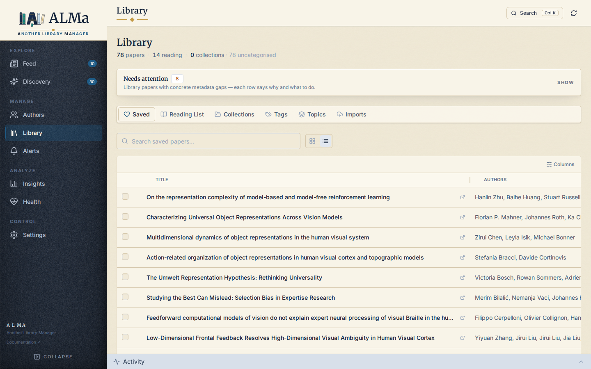
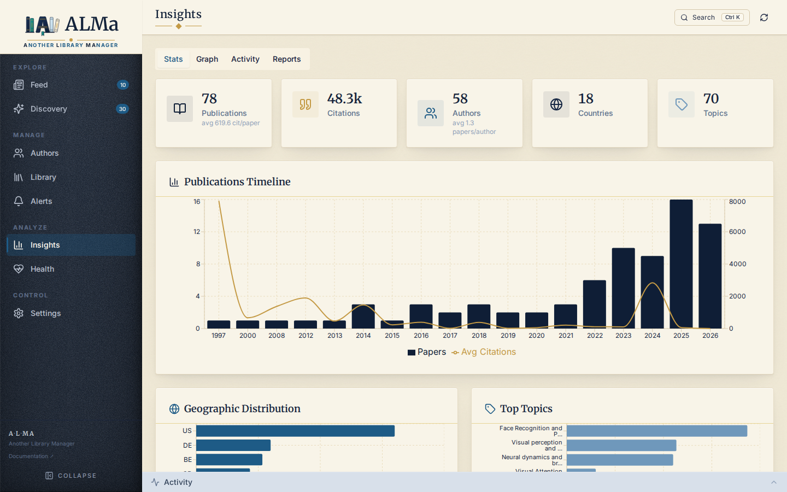
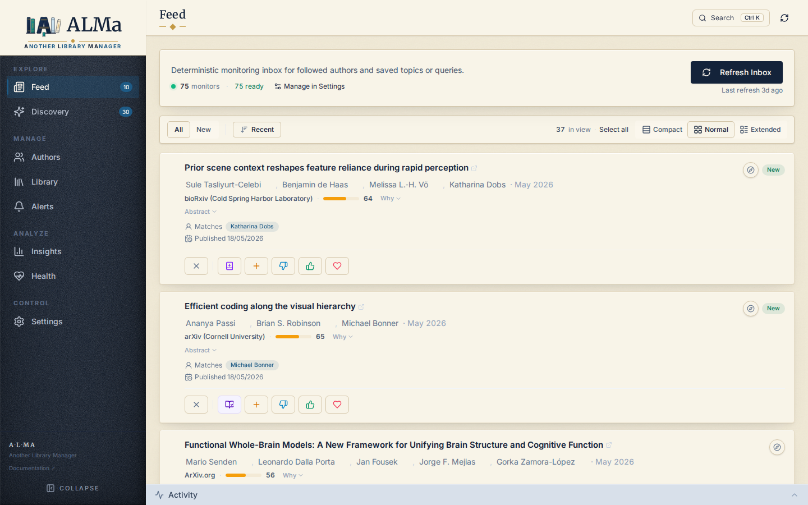
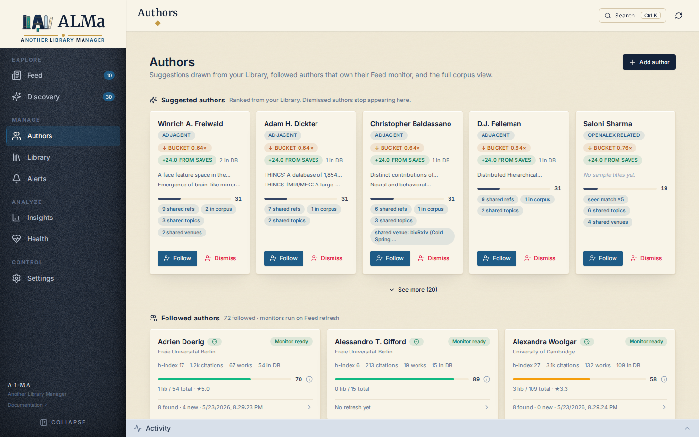
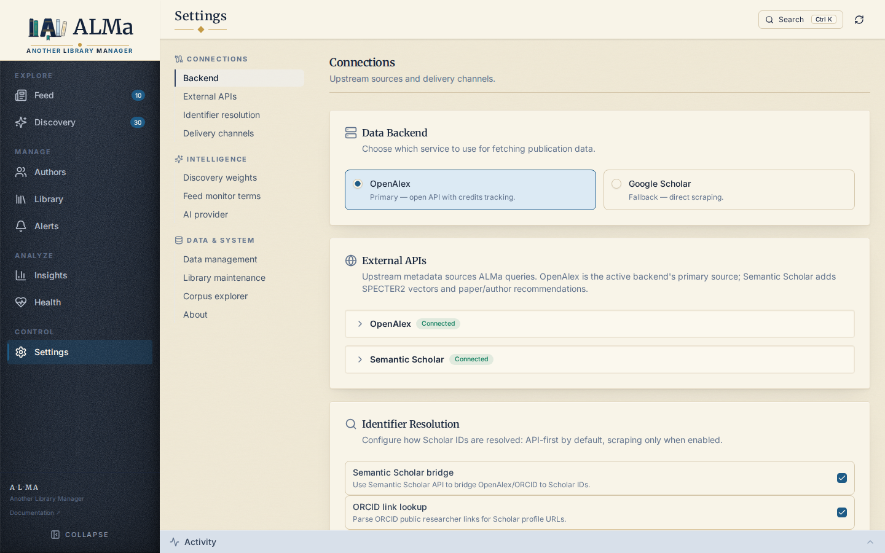

# ALMa — **A**nother **L**ibrary **Ma**nager

> **Early preview (`v0.10.1`).** The three core jobs — Library, Discovery,
> and Feed — work end-to-end. The first-run experience is bare; a polished
> onboarding ships with `v1.0.0`. Public testing welcome.

ALMa watches [OpenAlex](https://openalex.org/) (the open citation
graph) and Semantic Scholar for new work from authors and topics you
follow, builds a local SQLite library of the things you save, and uses
SPECTER2 embeddings to surface papers related to what you already care
about. It runs on your own machine — nothing about your reading list
leaves the box you put it on.

**Documentation:** <https://costantinoai.github.io/alma-library-manager/>

The app has five views:

- **Feed** — a chronological inbox of new publications from the
  authors and topics you follow.
- **Library** — every paper you've saved, with notes, ratings, tags,
  collections, and a reading list.
- **Authors** — the researchers you track, plus suggested authors
  whose work overlaps with what you read.
- **Discovery** — papers related to your library that haven't shown
  up in the Feed yet, ranked by topical and citation similarity.
- **Insights** — charts and a clustered map of your library: how it's
  spread across years, topics, journals, and which papers cluster
  together by content.

<p align="center">
  
  
</p>
<p align="center">
  
  
</p>
<p align="center">
  
  
</p>

---

## Quick start (one Docker command — suggested)

Run this exact command, replacing only `you@example.com` with the
email you want to identify yourself to OpenAlex (free, no signup
required):

```bash
docker run -d --name alma --restart unless-stopped \
  -p 127.0.0.1:8000:8000 \
  -e OPENALEX_EMAIL=you@example.com \
  -v alma-data:/app/data \
  -v alma-config:/app/config \
  ghcr.io/costantinoai/alma-library-manager:latest
```

Then open <http://localhost:8000>. That's the whole install.

> **You don't pick a directory.** `alma-data` and `alma-config` are
> *Docker volume names*, not host paths. Docker creates the volumes
> automatically the first time you run the command and stores the
> bytes itself (on Linux: under `/var/lib/docker/volumes/`; on Docker
> Desktop: inside the managed VM). You don't need to `mkdir` anything
> first. To inspect what's inside or copy a file out:
>
> ```bash
> docker volume ls                              # list volumes
> docker run --rm -v alma-data:/d alpine ls /d  # peek inside
> ```
>
> If you'd rather have a normal host folder (e.g. `~/alma/`) so you
> can browse the SQLite file directly, use the *Compose* path below
> — it's the right tool for that.

<details>
<summary>What each line of that command does</summary>

| Flag | What it does |
|---|---|
| `docker run -d` | Start a new container, **detached** (in the background). Without `-d`, your terminal stays attached and Ctrl-C kills the app. |
| `--name alma` | Give the container the human-readable name `alma`, so later commands can refer to it (`docker logs alma`, `docker stop alma`). |
| `--restart unless-stopped` | Auto-restart on crashes, on Docker daemon restarts, and on host reboots. Stays stopped if *you* explicitly `docker stop` it. |
| `-p 127.0.0.1:8000:8000` | Map host port 8000 to the container's port 8000, listening only on `127.0.0.1` (loopback). The app is reachable at `http://localhost:8000` from your machine but **not** from your network. To expose it remotely, drop the `127.0.0.1:` prefix and put a reverse proxy + `API_KEY` in front. |
| `-e OPENALEX_EMAIL=you@example.com` | Set an environment variable inside the container. ALMa reads `OPENALEX_EMAIL` to enroll your requests in OpenAlex's polite pool — higher rate limits in exchange for being identified. |
| `-v alma-data:/app/data` | Mount the **named volume** `alma-data` at `/app/data` inside the container. Docker creates the volume automatically on first run. This is where `scholar.db` (your library) and the backups directory live. The volume survives `docker rm -f alma` and `docker pull` of a new image — only `docker volume rm alma-data` deletes it. |
| `-v alma-config:/app/config` | Same idea, but for plugin configs (Slack channel mappings, etc.). |
| `ghcr.io/costantinoai/.../:latest` | The image to run. `ghcr.io/...` is the GitHub Container Registry path; `:latest` tracks the newest release on `main`. Pin to `:0.10.1`, `:0.9`, or `:0` on shared servers. |

</details>

To upgrade:

```bash
docker pull ghcr.io/costantinoai/alma-library-manager:latest
docker rm -f alma
# rerun the same `docker run` command — your data lives in the volumes
```

To pin a specific version on a shared server, swap `:latest` for
`:0.10.1`, `:0.9`, or `:0`. The lite variant (smaller image, no local
SPECTER2 encoder; see *Two image variants* below) uses `-lite`
suffixes: `:latest-lite`, `:0.10.1-lite`.

> **More to configure?** Add `-e API_KEY=your-key` to require an
> `X-API-Key` header on every request, `-e SLACK_TOKEN=…` for Slack
> digests, etc. Full env-var reference:
> [docs/reference/configuration.md](docs/reference/configuration.md).

---

## Quick start (Docker Compose — for local builds or stack management)

If you're building the image from source, running ALMa alongside other
services, or you'd rather have host-side bind-mounts so you can poke
at `data/` directly:

```bash
mkdir alma && cd alma
mkdir -p data config
touch .env settings.json
chmod 666 .env settings.json   # so the container's appuser can read/write
```

Save as `docker-compose.yml`:

```yaml
services:
  alma:
    image: ghcr.io/costantinoai/alma-library-manager:latest
    # build: .   # uncomment to build locally instead of pulling
    container_name: alma
    restart: unless-stopped
    ports: ["127.0.0.1:8000:8000"]
    env_file: [.env]
    volumes:
      - ./data:/app/data
      - ./config:/app/config
      - ./settings.json:/app/settings.json
      - ./.env:/app/.env
```

Edit `.env` with at least `OPENALEX_EMAIL=you@example.com`, then:

```bash
docker compose up -d
docker compose logs -f alma   # follow the boot, Ctrl+C to detach
```

Update with `docker compose pull && docker compose up -d`. Your data
lives in the host folders next to the compose file; nothing personal
is baked into the image.

---

## After it starts

ALMa is empty on first launch — no library, no followed authors, no
recommendations. Three things to do, in order, before it becomes
useful:

1. **Add your email.** Edit `.env` and set `OPENALEX_EMAIL=you@example.com`.
   OpenAlex is free, no API key needed, but the email enrolls you in
   their polite pool so requests don't hit anonymous rate limits. (You
   can also set this from **Settings → External APIs** in the UI.)

2. **Follow a few authors.** Open **Discovery → Find & Add**, switch
   the scope toggle to **Author**, and search by name (an ORCID or
   OpenAlex ID also works if you have one). Pick three to five people
   whose work you actually want to track. Each follow kicks off a
   background backfill that pulls their recent papers into your
   corpus — you'll see it run under **Activity**.

3. **Wait one refresh.** Once the backfills finish, the **Feed**
   surfaces new papers from those authors and **Discovery**
   recommends related work. Save, like, or dismiss as you go — every
   action teaches the ranker what you actually care about.

Optional: if you have a BibTeX file or a Zotero library, import it
from **Library → Imports**. Existing references give Discovery much
better seed material from day one.

---

## Two image variants

ALMa publishes two flavours of the Docker image. Both run the full
app — Library, Discovery, Feed, Authors, Insights, the Insights graph,
clustering, BibTeX/Zotero imports. They differ only in whether the
local SPECTER2 encoder is bundled.

**`normal`** (the default, `:0.10.1`) includes `torch` + `transformers`,
so SPECTER2 embeddings can be computed locally on demand. Image size
is around 1.4 GB, peak runtime memory ~2 GB. Pick this on a desktop
or server with at least 4 GB RAM.

**`lite`** (`:0.10.1-lite`) drops `torch`. Image size is around
1.2 GB, runtime memory ~1 GB. You still get full embeddings via
Semantic Scholar's pre-computed SPECTER2 vectors (most papers with a
DOI have one) and you can configure OpenAI as the embedding provider
from Settings if you want. Pick this on a Raspberry Pi or a smaller
host where 1.5 GB of torch on disk is precious.

Both variants are published for `linux/amd64` and `linux/arm64`, so
Apple Silicon Macs and ARM servers (Pi, Graviton, Ampere) get native
images.

---

## Bare metal install (advanced)

Skip Docker only if you have a specific reason — the AI stack
(`torch`, `transformers`, `hdbscan`, `umap-learn`) has heavy native
dependencies that are easy to mismatch in unmanaged Python
environments.

You'll need Python 3.11+ and Node 20+. From a clean virtualenv:

```bash
git clone https://github.com/costantinoai/alma-library-manager.git
cd alma-library-manager
python -m venv .venv && source .venv/bin/activate

# Lite-equivalent
pip install -e ".[import]"
# Or normal-equivalent (with the AI stack)
pip install -e ".[ai,import]"

(cd frontend && npm ci && npm run build)

cp .env.example .env  # add your OpenAlex email
mkdir -p data config

uvicorn alma.api.app:app --port 8000
```

Open `http://localhost:8000`.

---

## Configuration in one paragraph

Most settings — Discovery weights, AI provider, clustering knobs —
live in the SQLite database and are tuned from the **Settings** page.
The `.env` file holds secrets (API keys, Slack tokens) and a few
deployment knobs (`DB_PATH`, `API_KEY`). The committed
`.env.example` is a fully-commented template; copy it to `.env` and
fill in what you have. The full reference is in
[docs/reference/configuration.md](docs/reference/configuration.md).

---

## Tech stack

Python 3.11 + FastAPI + SQLite (WAL) + APScheduler on the backend.
React 19 + Vite + TypeScript + Tailwind + shadcn/ui on the frontend.
Data comes from OpenAlex (primary), Semantic Scholar, Crossref, arXiv,
and bioRxiv. Embeddings are SPECTER2 (local via `transformers` +
`adapters`, or remote via Semantic Scholar / OpenAI). Clustering is
HDBSCAN over those vectors with UMAP for the 2D Insights graph.

---

## License

Licensed under [PolyForm Noncommercial 1.0.0](https://polyformproject.org/licenses/noncommercial/1.0.0/) —
a software-specific source-available license. Personal use, academic
research, hobby projects, and use by nonprofits or educational
institutions are all permitted. Commercial use is not. Attribution
(this `LICENSE` file and the copyright notice) must be preserved in
copies and derivative works. See [LICENSE](LICENSE) for the full text.

---

## Author

**Andrea Ivan Costantino** · [github.com/costantinoai](https://github.com/costantinoai)
