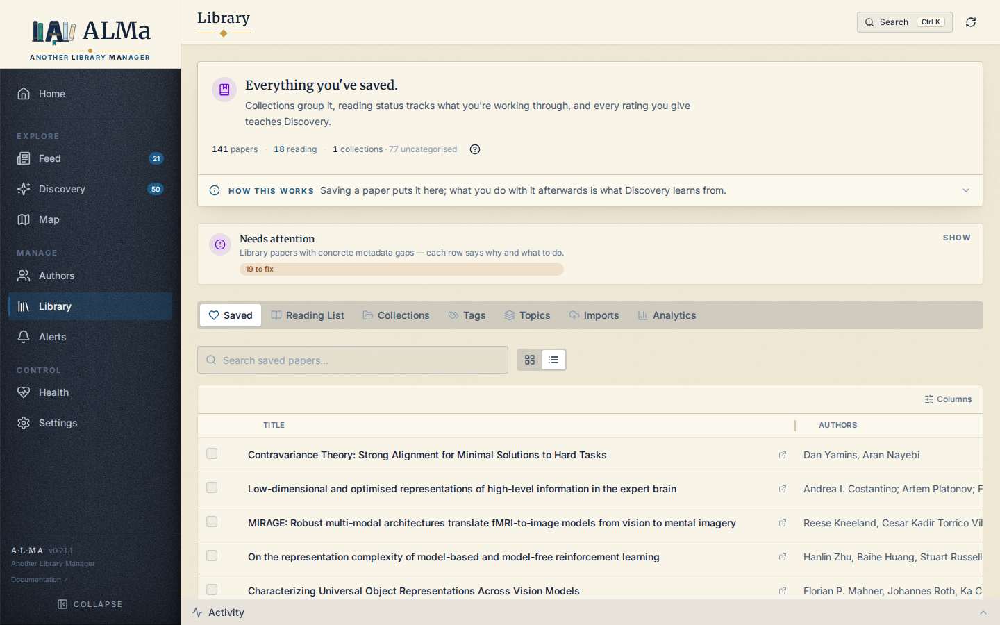

# Analytics

**Library → Analytics** projects your data into charts and reports. Read-only — Analytics is for understanding your corpus, not
editing it.

!!! note "It used to be its own page"
    Analytics was a top-level *Insights* page. It now lives as a tab inside
    **Library**, because it describes your library and belongs beside it. Old
    `#/insights?tab=…` links still work — they redirect to the matching
    Analytics section.

!!! note "Analytics is what you read; Health is what you fix"
    The old *Diagnostics* tab is gone. Its operational half — failed background
    operations, quality scorecards, recent refreshes — moved to the
    **[Health](health.md)** page's **Activity** tab, next to the repairs it
    explains. Its five passive trend charts were deleted rather than moved:
    they plotted history nobody acted on. Rule of thumb: a chart you read →
    Analytics; something wrong you fix → Health.



## Tabs

### Overview

The default section. Aggregated metrics:

* **Summary** — total papers, total followed authors, total
  collections, total tags.
* **Publications timeline** — bars for volume, plus a **median**
  citations line. Median is the default because one runaway paper drags a
  year's *mean* far from where its papers actually sit; the mean is one
  toggle away, dashed. Dots above a bar mark that year's papers in your
  library-wide **top citation decile** (a paper must exceed the 90th
  percentile, not merely equal it). Hovering a year names its most-cited
  paper; clicking drills into that year, citations first.
* **Your topics** — clusters of *your* library, labelled by the c-TF-IDF
  terms that distinguish them. See the note below.
* **Top journals** — a ranked list you can act on: each row drills into its
  papers and can be **followed** on the spot, using the same follow state as
  the paper cards. Journals with 3+ saved papers show a quiet "Follow?" hint.
* **Provenance** — where the work came from, with a Countries / Institutions
  switch (one question, two zoom levels, one card).
* **Authors rail** — the most-published / most-cited authors in your
  Library, with paper counts and h-index.
* **Recommendations engagement** — Discovery-side stats: total
  recs surfaced, seen, liked (positive action), dismissed, plus
  engagement rate.
* **Library** — total saved, average rating, total collections,
  total followed authors.

All Overview blocks are **Library-scoped** — they reflect the saved
corpus, not the entire tracked set.

!!! note "Your topics are yours, not a global taxonomy"
    This card used to show OpenAlex's subject taxonomy applied to your papers.
    It now shows how *your* library actually groups: the clusters computed from
    your SPECTER2 embeddings, each labelled by the terms that distinguish it.
    Those answer different questions, so the taxonomy no longer stands in for
    it — if embeddings aren't computed yet the card says so and points at
    **Settings → AI** rather than silently falling back. OpenAlex topics remain
    visible inside individual paper rows.

### Reports

Time-window summaries:

* **Weekly brief** — what was added, what shifted, what surfaced.
* **Topic drift** — how topic mix changes over time.
* **Signal impact** — which ranking signals correlate with useful outcomes.

**Collection intelligence** moved to the bottom of **Library → Collections**,
beside the collections it describes. It still generates on demand.

## How fresh is what I'm seeing?

**Charts (Overview / Reports)** are served from a fingerprint-keyed
cache: each GET returns the previously-computed payload in <10 ms;
when your data changes, the next page load serves the previous
snapshot while a background job rebuilds it, then swaps silently.
The **Refreshing…** pill in the header lights up during that window.

## Activity panel

Not part of Analytics, but always docked at the bottom of
the screen on every page:

* **Operations tab** — running and completed background jobs with
  progress, per-source timing, and a Cancel button on long-running
  jobs.
* **Logs tab** — real-time application logs filtered by level
  (`ERROR / WARNING / INFO / DEBUG`).

The Activity panel is where the [observable system](../vision.md#observable-system)
principle actually lives. Every meaningful operation has a job
envelope here; if it doesn't, that's a bug.

## API

```
GET /api/v1/insights                                      # full overview (Stats)
GET /api/v1/reports/weekly-brief
GET /api/v1/reports/collection-intelligence
GET /api/v1/reports/topic-drift
GET /api/v1/reports/signal-impact
```

The diagnostics endpoints (`/insights/diagnostics/sections/{section}`) power
the **Activity** tab. Their `operational` section also feeds the
**[Health](health.md)** page's System status cards (the actionable operational view).
