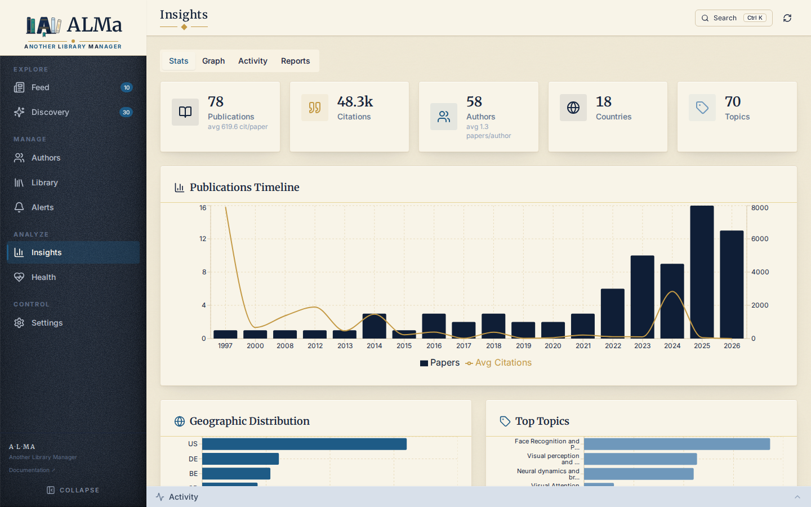

# Analytics

**Library → Analytics** projects your data into charts, maps, and a 2D
embedding graph. Read-only — Analytics is for understanding your corpus, not
editing it.

!!! note "It used to be its own page"
    Analytics was a top-level *Insights* page. It now lives as a tab inside
    **Library**, because it describes your library and belongs beside it. Old
    `#/insights?tab=…` links still work — they redirect to the matching
    Analytics section.

!!! note "Analytics is what you read; Health is what you fix"
    The old *Diagnostics* tab is gone. Its operational half — failed background
    operations, quality scorecards, recent refreshes — moved to the
    **[Health](health.md)** page's **Activity** tab, next to the repairs it
    explains. Its five passive trend charts were deleted rather than moved:
    they plotted history nobody acted on. Rule of thumb: a chart you read →
    Analytics; something wrong you fix → Health.



## Tabs

### Overview

The default section. Aggregated metrics:

* **Summary** — total papers, total followed authors, total
  collections, total tags.
* **Publications timeline** — bars for volume, plus a **median**
  citations line. Median is the default because one runaway paper drags a
  year's *mean* far from where its papers actually sit; the mean is one
  toggle away, dashed. Dots above a bar mark that year's papers in your
  library-wide **top citation decile** (a paper must exceed the 90th
  percentile, not merely equal it). Hovering a year names its most-cited
  paper; clicking drills into that year, citations first.
* **Your topics** — clusters of *your* library, labelled by the c-TF-IDF
  terms that distinguish them. See the note below.
* **Top journals** — a ranked list you can act on: each row drills into its
  papers and can be **followed** on the spot, using the same follow state as
  the paper cards. Journals with 3+ saved papers show a quiet "Follow?" hint.
* **Provenance** — where the work came from, with a Countries / Institutions
  switch (one question, two zoom levels, one card).
* **Authors rail** — the most-published / most-cited authors in your
  Library, with paper counts and h-index.
* **Recommendations engagement** — Discovery-side stats: total
  recs surfaced, seen, liked (positive action), dismissed, plus
  engagement rate.
* **Library** — total saved, average rating, total collections,
  total followed authors.

All Overview blocks are **Library-scoped** — they reflect the saved
corpus, not the entire tracked set.

!!! note "Your topics are yours, not a global taxonomy"
    This card used to show OpenAlex's subject taxonomy applied to your papers.
    It now shows how *your* library actually groups: the clusters computed from
    your SPECTER2 embeddings, each labelled by the terms that distinguish it.
    Those answer different questions, so the taxonomy no longer stands in for
    it — if embeddings aren't computed yet the card says so and points at
    **Settings → AI** rather than silently falling back. OpenAlex topics remain
    visible inside individual paper rows.

### Graph

A 2D projection of your Library's SPECTER2 vectors. Requires that
embeddings have been computed (either pulled from Semantic Scholar
or generated locally). When no embeddings are available the page
falls back to a principled text-TF-IDF clustering on title +
abstract; it never clusters on `publication_topics` (OpenAlex's
coarse topic vocabulary), journal, or author names.

#### Pipeline (BERTopic recipe)

```
SPECTER2 vectors (768-d)
    │
    ├─▶ L2-normalise rows (cosine geometry — what SPECTER2 was trained for)
    │
    ├─▶ UMAP n_components=5  (cosine, n_neighbors=15)   ── clustering substrate
    │       │
    │       └─▶ HDBSCAN(metric='euclidean', leaf)       ── density clusters
    │
    └─▶ UMAP n_components=2  (cosine)                   ── 2-d display layout
```

L2-normalising puts every vector on the unit sphere, so euclidean on
the reduced space is rank-equivalent to cosine in the original 768-d
space — letting HDBSCAN/UMAP/kmeans use their fast euclidean code
paths without leaving the geometry SPECTER2 was trained for.
UMAP-reducing to 5-d before HDBSCAN solves the curse of
dimensionality: density estimates are unreliable in 768-d at our
scale (50–500 papers) but tractable at 5-d. Both the clustering
substrate and the display layout read the same L2-normalised input
through cosine UMAP, so visual proximity and cluster boundaries
agree by construction — neighbouring papers in the layout are also
in the same cluster.

#### Behaviour

* **Auto-k clustering** — HDBSCAN with `cluster_selection_method='leaf'`
  picks the cluster count automatically; no fiddling with `k`.
  `min_cluster_size = max(3, min(12, ⌈√n × 0.5⌉))` so a 50-paper
  library produces 5–8 well-balanced clusters and a 300-paper library
  produces 15–25.
* **Distinctive cluster labels** — class-based TF-IDF (the BERTopic
  c-TF-IDF formula) over (1, 2)-grams of each cluster's member titles
  + abstracts. An English + academic-domain stop-list (`study`,
  `method`, `result`, …) is removed before scoring, and a bigram
  absorbs its constituent unigrams in the final phrase so labels read
  as topics (`"visual cortex, object recognition"`) rather than
  bag-of-keywords. Labels persist in `graph_cluster_labels` keyed by
  the cluster's member-set signature; the **Refresh cluster labels**
  job recomputes them in the background and pushes the result
  through the same materialised-view layer.
* **Hover detail** — paper title, year, journal, rating.

Graph data is cached server-side via the materialised-view layer
(fingerprint-keyed, see [Performance](../operations/performance.md)).
Re-clustering is opt-in via Settings → Operational status →
**Rebuild graphs**.

#### Fallbacks

* **UMAP unavailable / N < 15** → cluster on the L2-normalised raw
  vectors with HDBSCAN. Same geometry, just no dimensionality
  reduction.
* **HDBSCAN unavailable** → silhouette-driven `MiniBatchKMeans`
  with `k ∈ [2, 30]` on the reduced space.
* **HDBSCAN collapses to ≤ 3 clusters on N ≥ 18** → same kmeans
  rescue so the paper map is never reduced to a few mega-clusters.
* **No embeddings at all** → text-TF-IDF clustering on title +
  abstract. Never `publication_topics`, never journal/authors as
  topical features. Falls back to an unclustered grid when text is
  too sparse.

### Reports

Time-window summaries:

* **Weekly brief** — what was added, what shifted, what surfaced.
* **Topic drift** — how topic mix changes over time.
* **Signal impact** — which ranking signals correlate with useful outcomes.

**Collection intelligence** moved to the bottom of **Library → Collections**,
beside the collections it describes. It still generates on demand.

## How fresh is what I'm seeing?

**Charts (Overview / Reports)** are served from a fingerprint-keyed
cache: each GET returns the previously-computed payload in <10 ms;
when your data changes, the next page load serves the previous
snapshot while a background job rebuilds it, then swaps silently.
The **Refreshing…** pill in the header lights up during that window.

**Maps (Paper Map / Author Network)** follow a stricter contract: the
2-D layout is a durable artifact — ONE corpus-scope "substrate"
(positions + clusters + labels), computed only by background jobs,
never during a page load. Opening the map is a pure read of the
stored payload (fast at any corpus size). Freshness is owned by the
**graph layout maintenance** job (every 6 h, idle-gated):

* a paper that gains a vector is placed **incrementally** at its
  nearest cluster centroid, usually within minutes of the vector
  arriving — no re-layout;
* a **full re-layout** happens only when the embedding set drifts
  ≥20 %, the algorithm/model version changes, or the layout is a
  week old.

The map header shows when the layout was built and how many new
papers await the next fold-in. The Library map is a *filter* of the
corpus substrate — there is no second layout, so the two views can
never disagree about where a paper sits. To force a fresh layout
right now, the **Rebuild graphs** button still works; custom knob
combinations (a different cluster detail, a fused layout) build in
the background too — the map shows "Building this view…" and appears
automatically when ready.

## Activity panel

Not part of Analytics, but always docked at the bottom of
the screen on every page:

* **Operations tab** — running and completed background jobs with
  progress, per-source timing, and a Cancel button on long-running
  jobs.
* **Logs tab** — real-time application logs filtered by level
  (`ERROR / WARNING / INFO / DEBUG`).

The Activity panel is where the [observable system](../vision.md#observable-system)
principle actually lives. Every meaningful operation has a job
envelope here; if it doesn't, that's a bug.

## API

```
GET /api/v1/insights                                      # full overview (Stats)
GET /api/v1/graphs/paper-map                              # Graph (paper map)
GET /api/v1/reports/weekly-brief
GET /api/v1/reports/collection-intelligence
GET /api/v1/reports/topic-drift
GET /api/v1/reports/signal-impact
```

The diagnostics endpoints (`/insights/diagnostics/sections/{section}`) power
the **Activity** tab. Their `operational` section also feeds the
**[Health](health.md)** page's System status cards (the actionable operational view).
