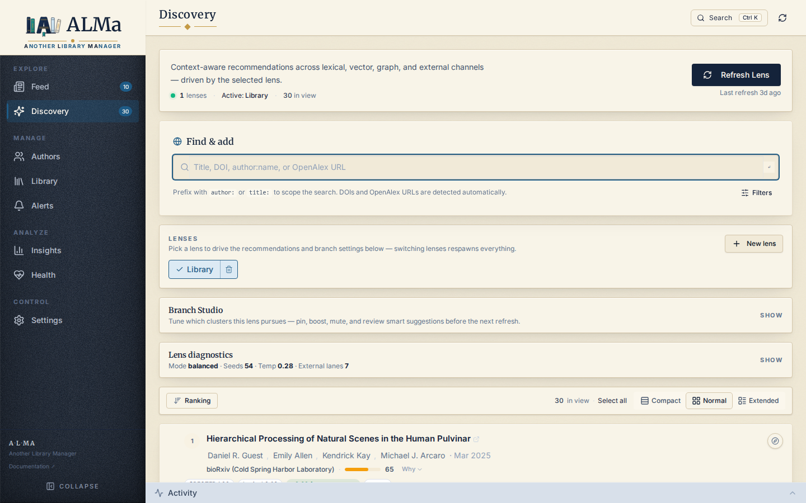

# Discovery

**Discovery** answers: *given what I have saved, liked, disliked, or
followed, which papers might I want to add next?*

It is explicitly different from [Feed](feed.md):

| Feed | Discovery |
|---|---|
| Deterministic monitoring | Probabilistic recommendation |
| Chronological | Ranked by relevance |
| One source = one row | Multi-source retrieval, deduplicated |
| Window: ~60 days | Window: open |

## How a recommendation is produced

Discovery is organised around **lenses** — context-scoped pipelines.
The default "global Library" lens treats your entire saved
collection as the seed. You can also define lenses scoped to a
[collection](library.md#collections), a topic keyword, or a tag (see
[Lenses](lenses.md)).

For each lens, refresh runs in four phases:

1. **Retrieval** — fan out across multiple sources to assemble a
   candidate set.
2. **Ranking** — score each candidate via a 10-weight hybrid
   formula.
3. **Diversity-aware staging and filtering** — sort by the final
   score, then run a diversity selector that keeps score-qualified
   candidates from collapsing onto one source, branch, author, venue, or topic.
   The staging pool is larger than the visible limit so lifecycle
   filters can remove saved / dismissed / duplicate papers without
   starving the final page.
4. **Branch planning** — cluster the lens seed papers into themed
   branches and use those branches to plan extra external retrieval
   lanes. Branches are visible in Branch Studio, but not every
   persisted recommendation currently carries branch attribution.

### What never re-surfaces

Two filters run before staging, on top of scoring:

* **Saved papers** (`status='library'`) — once you save a paper it
  belongs to your Library and is permanently excluded from Discovery.
* **Dismissed papers** (`status='dismissed'`) — explicit dismissals
  block re-surfacing.

`Dislike` is intentionally softer: it hides the current
recommendation row and writes a negative signal, but leaves the paper
as `tracked` so it can still be found later if enough new evidence
outweighs the penalty.

Everything else is fair game. Specifically, papers your corpus has
already pulled in but that you haven't saved (`status='tracked'`)
are valid candidates — they may carry an embedding, topics, and
authorship metadata that make them genuinely useful re-suggestions
under a different lens or after enough new feedback shifts the
profile. Tracked papers used to be double-blocked by a permanent
"any prior interaction" filter; that block was removed because it
created a dead funnel as the corpus grew.

### Retrieval channels

| Channel | Source | What it returns |
|---|---|---|
| **OpenAlex related works** | OpenAlex `/works/{id}/related-works` | Papers OpenAlex itself flags as related to your saved papers. |
| **OpenAlex topic search** | OpenAlex `/works?filter=topics.id:…` | New papers in topics you've saved into. |
| **Followed-author works** | OpenAlex `/works?filter=author.id:…` | Recent works from authors on your follow list. |
| **Taste-author search** | OpenAlex / S2 keyword search | Targeted queries built from your top preferred authors — but **only authors who don't dominate your library** (cap: 40% of saved papers). Sending an explicit "Smith et al." query when 60% of your library is already Smith just amplifies him; that author still gets ranking credit through `author_affinity`, we just don't fan out external API budget at him. |
| **Co-author network** | OpenAlex graph | Papers by frequent co-authors of your saved authors. |
| **Citation chain** | OpenAlex / S2 | Papers that cite your highly-rated papers. |
| **Semantic Scholar related** | S2 `/recommendations` | S2's own recommender, with optional filters. |
| **SPECTER2 cosine** | local cache | Top-k cosine neighbours of your library centroid (if embeddings are enabled). The lane scores **every embedded paper in the corpus** against the centroid — not a sampled subset — so the top-K is the actual best-K, not the best-K of an arbitrary first-1000 rows. |
| **Local references (graph)** | local `publication_references` | Papers your seeds cite, ranked by how many papers across the **entire local corpus** cite each reference (with a tie-break by how many seeds cite it). The corpus-wide count cushions the recency penalty seed-only counting would create — a 2024 paper cited by one seed and four other corpus papers outranks a 2010 paper cited by one seed and nothing else. The recency_boost in the scorer takes over from there once OpenAlex enrichment supplies the publication date. |

Channels can be enabled / disabled / weighted in **Settings →
Discovery weights**. Each channel runs with a per-lane deadline so a
single slow source can't stall the whole refresh.

#### Best-of-K vs first-N

Every channel that we pick from a candidate list (lexical, vector,
graph, external) ranks before truncating to the per-lane budget:

| Channel | Sort order |
|---|---|
| Lexical (OpenAlex search) | `relevance_score:desc` |
| Vector (local SPECTER2) | cosine similarity to your library centroid (full corpus, not sampled) |
| Graph: local references | `corpus_overlap DESC, seed_overlap DESC` (see above) |
| Graph: OpenAlex related-works | OpenAlex's own relatedness algorithm |
| Graph: citing-works | `cited_by_count:desc` |
| Graph: referenced-works | `publication_year:desc` (recency-prioritized) |
| Followed-author works | `publication_date:desc` (newest first) |
| Taste-author / -topic / -keyword search | `relevance_score:desc` |
| S2 recommendations | S2's own recommender ranking |

So whatever the per-lane cap is set to, you're getting *the best* of
that source — not whatever the source happened to surface first.

### Ranking signals

The hybrid scorer combines (default weights configurable):

* **Source relevance** — how strong was the signal that produced the
  candidate (high for related-works, lower for broad topic search).
* **Topic score** — overlap between the candidate's topics and your
  preferred topics.
* **Text similarity** — semantic (SPECTER2 cosine if available) +
  lexical fallback (TF-IDF + character n-grams + scholarly term
  overlap).
* **Author affinity** — has the candidate's author appeared in your
  Library or follow list? Affinity weights use **log-prevalence**
  (`log(1 + count) / max_log`) for authors, topics, and journals
  alike, so a single dominant author can't crowd the long tail down
  to noise. Co-authors that appear on a handful of saved papers
  still register as "this is someone you've worked with."
* **Journal affinity** — does the candidate's venue appear often in
  your Library?
* **Recency boost** — newer papers get a small boost. The boost
  reads `year` first, then falls back to parsing `publication_date`
  so corpus-rehydrated papers (where `publication_date` was filled
  but `year` may not be) still surface here. This is intentional —
  Discovery is a place to find recent-but-not-yet-monitored work,
  complementing what the Feed already shows.
* **Citation quality** — log-scaled citation count.
* **Feedback adjustment** — boosts or penalises candidates connected
  to papers you've liked, loved, disliked, dismissed, or removed. The
  signal propagates through the paper itself, its authors and
  co-authors, topics, venue, keywords, and tags.
* **Preference affinity** — distance from your `preference_profiles`
  centroid.
* **Usefulness boost** — explicit per-source bonus.

After the 10 weighted signals are summed, a **multi-source consensus
bonus** rewards candidates that were independently surfaced by more
than one retrieval source. Each non-external channel (`lexical`,
`vector`, `graph`) counts as one source; the `external` channel
counts each distinct source API (`openalex`, `semantic_scholar`, …)
separately. With $N$ confirming sources, the bonus is
$0.12 \times 100 \times \sqrt{N - 1}$ — a diminishing-returns curve
that gives +12 / +17 / +21 / +24 for 2 / 3 / 4 / 5 sources agreeing,
clamped at 100. See `docs/reference/scoring.md#multi-source-consensus-bonus`.

Each candidate's `score_breakdown` is exposed in the API so the UI
can show the signals that pushed a recommendation up or down. The
breakdown also carries `consensus_buckets`, `consensus_count`, and
`consensus_bonus` so multi-source agreement is auditable.

After consensus, a final **outcome-calibration multiplier** scales
`source_relevance` per candidate. Three independent axes — the
source API that surfaced the candidate, the retrieval lane mode,
and the specific branch — each carry a Bayesian-smoothed quality
estimate in `[0.5, 1.5]` based on observed save / dismiss rates.
The three are composed multiplicatively in log space and clamped
back to the same band. Empty on a fresh DB → 1.0 → no behavior
change. Surfaced in the breakdown as `source_calibration_multiplier`
and `source_calibration_components`. See `docs/reference/scoring.md
#outcome-calibration`.

### Branches

Branches are themed clusters of a lens's **seed papers**. Today they
are primarily a retrieval-planning device: Discovery builds branch
core/explore queries and spends part of the external-source budget on
those queries. Branch-attributed candidates that remain relevant after
scoring can survive into the persisted recommendation set, giving the
branch outcome data for auto-weighting. A branch has:

* A label derived from discriminative seed-paper topics and
  representative titles.
* Core and explore topics used to construct branch-specific external
  searches.
* Representative seed papers.
* Manual control state (`pin`, `boost`, `mute`) plus an `auto_weight`
  when enough branch-attributed outcomes exist.

The Branch Studio UI lets you pin / mute / boost a branch. Those
controls affect branch-specific external retrieval budget on the next
lens refresh. Current production branches are not yet the persistent
hierarchical interest tree described in the experimental branched user
model work; branch outcome learning still depends on enough
recommendations being persisted with `branch_id`.

#### How branches are built

`_build_seed_branches` runs at the start of every lens refresh:

1. **Cluster the seeds.** When ≥ 4 of your library papers carry
   embeddings, K-means clusters them in SPECTER2 space; otherwise a
   lexical fallback assigns each seed to its most *distinctive*
   token (TF-IDF against the rest of the library — not the most
   *common* token, which would collapse every paper containing
   "neural" into one bucket).
2. **Right-size K.** After K-means the system checks pairwise
   centroid similarity and merges any pair above 0.85. So a
   coherent library that forced K=6 doesn't end up with five
   near-duplicate clusters wasting external API budget on
   overlapping searches; you get fewer-but-distinct branches when
   the data supports it.
3. **Per-cluster topics with TF-IDF.** Each branch's `core_topics`
   are extracted with the cluster's tokens scored against *all
   other clusters' tokens*. So a token that appears in every
   cluster (e.g. "neural" in a neuroscience library) is suppressed,
   leaving the discriminative term as the branch's identity. This
   is what stops every branch label from looking like
   "neural / cortex / model".
4. **Explore topics.** Each branch carries `explore_topics` from a
   neighbouring cluster — *temperature-gated*: at low temperature
   the explore topics come from the *nearest* cluster (gradient
   discovery, a small step away from core); at high temperature
   they come from the *farthest* cluster (leap discovery,
   genuinely orthogonal threads). The branch's `direction_hint`
   surfaces this so you know why it's pointing where it is.
5. **Branch identity.** `branch_id` is hashed from the cluster's
   sorted seed paper IDs, scoped by lens — so labels can drift
   without breaking the join to stored recommendations. When the
   seed set shifts even by one paper, the id changes, but…

#### Lineage: calibration + controls survive seed drift

When K-means reshuffles a single seed (say, you saved 3 papers
since the last refresh), the new cluster's `branch_id` is
technically different from the previous one. Two mechanisms ensure
your accumulated calibration and pin/mute/boost don't get lost:

* **Calibration lineage.** `_enrich_branches_with_outcomes` checks
  past `branch_id`s in `recommendations` for this lens and inherits
  the outcome history of any past branch whose seed set overlaps
  ≥ 70 % with the current cluster's seed set.
* **Control lineage.** `_apply_branch_controls` does the same for
  pin / mute / boost — a branch you muted three days ago stays
  muted after K-means reshuffles, as long as the new cluster is
  ≥ 70 % the same papers.

This lineage is best-effort and only has useful outcome data when
previous recommendations carried branch attribution. If a refresh
produces branch-lane candidates but none survive into persisted
recommendations with `branch_id`, Branch Studio can still show and
control branches, but auto-weighting and branch diagnostics have no
outcome stream to learn from.

The refresh summary includes `diversity` and `final_mix` diagnostics:
source-type counts, branch-attributed count, and max author / venue /
topic concentration. Those fields are the operational check that the
page is heterogeneous without dropping relevance too far.

#### Auto-weighting and the budget allocator

Every branch gets an **auto_weight** in `[0.3, 1.8]` derived from
its save / negative-action history (`_compute_branch_auto_weight`):

* Bayesian-smoothed positive share, prior strength 6.0, so
  ~6 actions are needed before the weight moves meaningfully.
* Each action is exponentially decayed with a 30-day half-life.
  The aggregation window is 60 days. Old signal naturally fades; the branch
  drifts back toward neutral 1.0 as fresh data dominates.
* New branches with no history start at 1.15 (cold-start
  visibility lift), so they actually get surface area to
  accumulate signal in their first couple of refreshes.

The auto_weight is the proportional share each active branch gets
of the external lane's per-refresh candidate budget — strong
branches get more API queries, weak ones get fewer. Pin and boost
are **floors** on top: pinned branches get at least 1.65×, boosted
at least 1.3×, regardless of auto_weight.

Two safety floors prevent self-fulfilling weakness:

* `branches.min_budget_per_branch` (default 8) — no active branch
  drops below 8 candidates from the external lane regardless of
  auto_weight. A weak branch needs enough volume to ever recover.
* Muted branches receive zero budget but stay in the cluster set,
  so unmuting recovers them instantly.

#### Auto lifecycle: rotate, then auto-mute

When a branch's auto_weight crosses meaningful thresholds, the
system intervenes automatically before the next refresh:

| auto_weight | What happens |
|---|---|
| ≥ 0.65 | Normal. Branch keeps its core_topics, gets its proportional budget. |
| 0.55 < x ≤ 0.65 | **Rotated.** Branch keeps the same seed set (and its accumulated calibration history), but its `core_topics` and `explore_topics` are *swapped* for the next refresh. The system probes the explore-angle while the core angle has been accumulating dismisses. The label updates to reflect what the branch is actually probing. If the rotation pulls saves, auto_weight rises and the rotation reverses on the refresh after — fully self-correcting. |
| ≤ 0.55 | **Auto-muted.** Branch's external lane budget drops to zero. The cluster's seeds still influence ranking through their centroid + the author / topic / venue affinities, but the system stops fanning external API queries off it. The user can manually unmute or pin in Branch Studio to override. |

User-set pin and boost take precedence over both rotate and
auto-mute — once you've explicitly endorsed a branch, the system
defers to you. User-set mute is preserved.

The thresholds (`0.65` and `0.55`) and the constants underneath
them (`PRIOR_STRENGTH = 6.0`, `HALF_LIFE_DAYS = 30`) live in
`application/discovery.py` near `_compute_branch_auto_weight`.
They're tuned for "noticeable enough to act on, not so reactive
that one bad day kills a branch."

## Actions on a Discovery card

| Action | What it does |
|---|---|
| **Save / Like / Love** | Transitions to `library` with the matching rating. |
| **Dismiss** | Hides the card from this lens **and** writes a negative signal. The recommender will not re-suggest it. |
| **Dislike** | Hides the current recommendation and writes a negative signal without changing the paper's lifecycle status. |
| **Pivot** | Treats the dismissed paper as a seed for a new branch (find more like this, but I haven't saved it). |
| **Open details** | Opens the shared Paper detail panel — abstract, topics, prior / derivative works, full provenance. |

Paper feedback is graph-shaped, not just paper-shaped. A 5-star paper
raises nearby authors, topics, venues, keywords, tags, close semantic
neighbours, and local citation neighbours; a dismissed or disliked
paper lowers those connected signals. Following an author adds a
positive author signal to Discovery, and rejecting an author adds a
negative ranking signal through that author's profile. This changes
ranking only. It does not delete papers, unfollow authors, or mutate
paper lifecycle state.

The Paper detail panel shows **Prior works** (papers this one cites)
and **Derivative works** (papers that cite this one). For papers
already in our corpus, those panels link directly; for S2 rows we
haven't imported, they show a stub with citation intent metadata.

## Performance

A canonical lens refresh against ~330 saved papers completes in
about **76 seconds** end-to-end. Subsequent refreshes against the
same lens use cached candidates and are dramatically faster. See
[Performance](../operations/performance.md) for the full budget
table and how to profile your own refresh.

## What Discovery is not

* It is **not a search engine.** Discovery does not take a free-text
  query; it operates over your saved corpus. To search arbitrary
  papers, use the global search box or the Online search panel
  inside the Import dialog.
* It is **not deterministic.** Two refreshes of the same lens with
  the same Library can produce slightly different orderings — the
  signals shift as you save / dismiss things.
* It is **not infallible.** Read the score breakdown. If a branch
  looks wrong, dismiss its core papers — that's the loop that tunes
  the model.

## Read more

* [Lenses](lenses.md) — per-context pipelines
* [Scoring formulas](../reference/scoring.md) — the weight reference
* [Tuning Discovery](../user-guide/tuning-discovery.md) — practical
  guide
