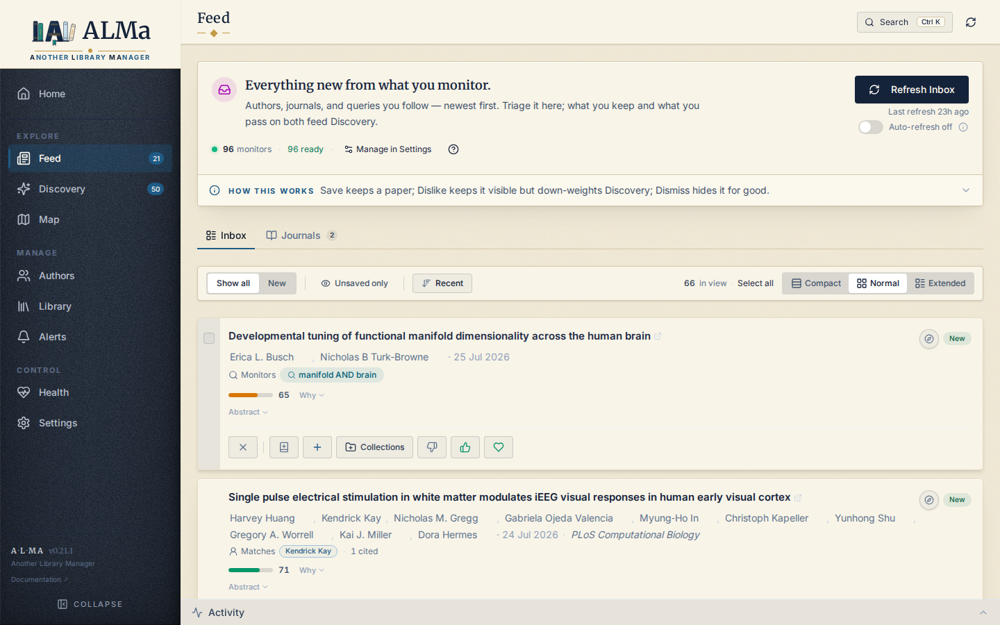

# Feed

The Feed is your **chronological inbox**. It surfaces papers you
haven't seen yet from sources you've explicitly told ALMa to watch.
Unlike Discovery (which is probabilistic and ranks by relevance),
the Feed is deterministic and orders strictly by time.



## What populates the Feed

A `feed_items` row is created when one of your **monitors** finds a
paper that's new to ALMa. The monitor types:

| Monitor | Source |
|---|---|
| **Author monitor** | A followed author publishes a new work (OpenAlex). |
| **Topic monitor** | OpenAlex returns a new work matching a topic / concept query. |
| **Query monitor** | A free-text query against OpenAlex search returns a new work. |
| **Journal monitor** | A new work is published in a followed journal — matched by exact OpenAlex **source id** (see below), not a name search. |

Journal monitors are noisy by nature (a busy venue publishes constantly),
so they live on their **own Feed surface** — the **Journals** tab — instead
of mixing into the author/topic/keyword **Inbox**. See
[Journal (venue) monitors](#journal-venue-monitors).

Monitors run on a schedule (default: every few hours) via the
APScheduler background loop. You can also trigger them manually from
**Settings → Discovery weights → Feed monitor defaults** or from the
per-author "Refresh now" action.

### Monitor health

The Feed status strip surfaces a **"{N} degraded"** count when one or
more monitors are unhealthy. Hovering it opens a tooltip that lists
each degraded monitor by label, with its `health_reason` (or
`last_error`) when available — capped at 8 entries, with a
"+N more — see Settings" line when there are more. The values come from
the monitor's `health` / `health_reason` / `last_error` fields, so the
strip is a quick read on which sources are failing without leaving the
Feed.

## Window and ordering

The Feed is bounded to roughly the **last 60 days** by publication
date. Older items aren't deleted — they remain queryable from
Library (if saved), Discovery (as candidates), and the Corpus
Explorer (everything) — but they fall out of the Feed view to keep
the inbox fresh.

When `publication_date` is missing, ALMa falls back to
`fetched_at` (when the monitor first saw the paper) so items still
order correctly. There is no `YYYY-01-01` fabrication for missing
dates.

## Hiding what you've already dealt with

**Unsaved only** (in the control bar) hides papers already saved to your
Library or sitting on your reading list. It's **off by default**: Feed is a
chronological *record* of what your monitors found, and hiding what you kept
would make that record dishonest. Turn it on when you want the inbox to show
only what still needs a decision. The choice persists.

Reading-list papers count as dealt-with — you've committed to them, so they
aren't awaiting a decision either.

## New markers

**New means "arrived since you last opened the Feed"** — not "since the last
fetch". Papers reach the Feed from two directions: you press Refresh, and the
scheduler fetches while ALMa is closed. Both accumulate. If a manual refresh
brings 10 papers and an overnight run brings 20 more, the badge reads **30**
until you actually look; opening the Feed clears it.

The check is **per-paper**, not per-row — a paper credited to multiple followed
authors has multiple `feed_items` rows, each with its own `fetched_at`. A paper
counts as new only when:

* at least one of its rows still has `status = 'new'` (you haven't triaged it), AND
* the **earliest** `fetched_at` across all of its rows is later than your last
  visit — so a paper a second monitor re-surfaces doesn't re-light.

The visit is stamped by `POST /feed/seen`, which the page fires *after* it
renders: the batch you are looking at is the batch that gets cleared, and
reading the Feed never mutates what "new" means mid-request.

!!! note "Why the badge and the New list can differ by a card or two"
    The badge counts what still needs **triage**, so acting on a paper removes
    it. The **New list** keeps acted-on cards visible until the next visit —
    saving or liking a paper must not make it vanish out from under you
    mid-triage. Only Dismiss hides a card.

So a paper that was first surfaced in a previous fetch under author
A and re-surfaced this fetch under author B is **not** new — the
user has already seen it. Older untriaged rows still appear in the
Feed; they're just not badged. The sidebar bubble counts distinct
papers (not rows) using the same per-paper rule, so it tracks the
real "new this fetch" count.

## Journal (venue) monitors

Following a journal is a first-class monitor, but its matching and its
surface differ from the others. This section is the contract.

### What "follow a journal" does

Following a journal (from a paper card's venue name, the Journals tab, or
Settings) creates one enabled `feed_monitors` row with
`monitor_type = 'venue'`. It is keyed by the journal's **OpenAlex source id**
(`monitor_key` = the lowercased `S…` id — unique and rename-proof), and its
`config_json` carries `{ "query": "<display name>", "source_id": "S…",
"filter_keywords": [...] }`. Following does **not** fetch anything on its own —
it only registers the source. Papers arrive on the **next Feed refresh**
(manual **Refresh Inbox**, or the scheduled auto-refresh when enabled).

Resolution to a source id is deliberate: the follow UI searches OpenAlex
`/sources` and you pick the exact journal, so `"Cortex"` follows the journal
*Cortex* — never every paper whose text mentions the word.

### Where the items come from

On refresh, a venue monitor bypasses the free-text cross-source fan-out and
fetches directly from OpenAlex:

```
GET /works?filter=primary_location.source.id:{source_id}&sort=publication_date:desc
```

That is an **exact membership** query — every returned work was actually
published in that source. Results are upserted into `papers` and each match
gets a `feed_items` row with `monitor_type = 'venue'`. No other source
(Crossref, S2, arXiv, bioRxiv) participates for a venue monitor.

An optional **keyword filter** (`filter_keywords`) narrows a high-volume
journal: a candidate is admitted only if **any** keyword matches its title or
abstract (case-insensitive). An empty list admits the whole venue.

### Timeframe — what gets downloaded vs. what you see

Two different bounds apply, and they are not the same:

* **Download bound.** Each refresh pulls up to the monitor's
  `search_limit` (default **15**, per-monitor override allowed) most-recent
  works published on or after `from_year`, where
  `from_year = max(current_year − monitor_defaults.recency_years, global
  fetch year)` and `recency_years` defaults to **2**. Because the sort is
  `publication_date:desc`, successive refreshes keep pulling the newest works.
* **Display bound.** The Feed view — Inbox *and* Journals — is bounded to the
  **last 60 days** by publication date (falling back to `fetched_at` when the
  date is unknown). The **New** view shows papers that arrived since your last
  visit.

So a journal shows its **recent (≤60-day)** papers; the ~2-year download
window only caps how far back the OpenAlex query reaches. Older fetched works
remain in the corpus (Library / Discovery / Corpus Explorer) but age out of
the Feed like everything else.

### Independence — the Journals tab shares state with the rest of ALMa

The Journals tab and the Inbox are **two filtered views of the same
`feed_items` table** (`monitor_scope=journals` vs `inbox`), not separate
inboxes. A paper is one canonical `papers` row, so its **rating, membership
status, and reading status are shared everywhere** — the Feed, Library, and
Discovery all read the same paper.

Concretely:

* A paper matched by **both** a followed author and a followed journal appears
  in **both** the Inbox and the Journals tab (one `feed_items` row per
  monitor). They *coexist* as views.
* Any action settles **every** `feed_items` row for that paper together
  (`apply_feed_action` writes `WHERE paper_id = ?`). **Save / Like / Love**
  add the shared paper to Library; **Dismiss** hides the paper from **both**
  surfaces at once; **Dislike** down-weights it but keeps it visible. There is
  no per-surface rating or per-surface dismiss.

In short: journal items are not an independent stream with their own state —
they are a *lens* onto the same papers, sharing one rating/status per paper.

### Managing followed journals

Followed journals appear as collapsible groups on the **Journals** tab (each
with a "N new" badge and total count), and a "Merge journals" toggle flattens
them into one stream. A journal you just followed shows immediately as a quiet
"no papers yet · Refresh to fetch" row until its first refresh brings papers.
Order is user-controlled (drag-to-reorder, persisted per monitor). A legacy
name-only venue row (pre-source-id) is disabled and marked
`needs_resolution` until you re-link it to a source.

## Actions on a Feed item

Each card shows the paper's metadata alongside a one-line **TL;DR**
(`tldr`) and an **influential-citation count**
(`influential_citation_count`) when those are available — both are now
carried on the wire by the feed list query, so the card reflects the
same enriched content as the rest of the app.

Each card carries the standard rating vocabulary:

| Action | What it does |
|---|---|
| **Save** | Transitions the paper to `library`, default rating 3. |
| **Like** | Saves with rating 4. |
| **Love** | Saves with rating 5. |
| **Dislike** | Down-weights the paper — records a negative signal and stamps rating 1. The paper **stays visible** in the Feed; chronological truth is preserved. |
| **Dismiss** | **Hides the paper from the Feed for good** — settles every `feed_items` row for the paper to `status = 'dismissed'`, which the list query excludes permanently. Sends a small negative signal (no rating stamp), and offers an **undo** right after. |
| **Queue** (reading status select) | Adds the paper to the Reading list. Independent of saving. |

The Dislike-vs-Dismiss split is the core nuance (D6). **Dislike** is the
soft verb: it lowers the paper's standing without removing it, so the
inbox keeps its complete chronological record. **Dismiss** is the one
"forever" verb in the Feed: it hides the paper from the inbox for good —
but because that's a heavy action, it always carries a transient **Undo**
that restores the rows to `new` and drops the negative signal. Both
actions also feed Discovery (Dislike and Dismiss both down-weight what
the recommender shows).

Dismiss applies per card and in bulk: the per-card control and the
selection bar's **Dismiss** button both settle the chosen items to
`dismissed`.

## Refresh contract

Feed refresh is the heaviest scheduled job in ALMa. It runs each
monitor in parallel, deduplicates results (a single new paper across
two monitors creates one row), and writes a single `feed_items`
batch.

While a refresh is running:

* Other reads (`/api/v1/library/saved`, `/api/v1/feed`,
  `/api/v1/authors`) stay responsive — they don't block on the
  refresh.
* The **Activity panel** shows a job envelope with per-source
  timing.
* If a source fails (e.g. OpenAlex returns 5xx), the failure is
  recorded against that source only; other sources still complete.

A refresh runs in the background job pool — the triggering `POST`
returns immediately — and while it's running, an in-page
**RefreshRunningBanner** shows on the Feed so you know a lens/feed
refresh is in flight without watching the Activity panel.

Near the top of the Feed, a collapsed **ConceptCallout** explains the
action contract in one place: Add / Like / Love save the paper (Love
rates it 5★), Dislike down-weights it but keeps it visible, and Dismiss
hides it for good (with undo). This keeps the Dislike-vs-Dismiss split
discoverable without per-button tooltips.

## Read endpoints

Both endpoints below are pure reads. They do not write to mirror
tables or sync state.

```
GET /api/v1/feed?limit=&since_days=
GET /api/v1/feed/monitors
```

See the [REST API reference](../reference/api.md) for the full
parameter set.

## What the Feed is not

* It is **not** a recommendation surface. The Feed shows you what
  your monitors found. If you want "papers like the ones I've saved",
  use [Discovery](discovery.md).
* It is **not** a search interface. To search, use the global search
  box (top of the app) — a result jumps straight to its item, opened on
  its owner page (paper or collection/topic in Library, author in
  Authors) — or query the Library / Corpus Explorer.
* It is **not** infinite. The bound is a **60-day time window** by
  publication date — not a 60-item cap. The inbox keeps it scannable;
  to see items older than 60 days, use Library (saved) or Discovery
  (candidates).

The inbox isn't hard-capped at one page either. It loads the first
**60 items** and offers a **"Load more · N of TOTAL"** button that
grows the list a page (60) at a time, all within the 60-day window —
`TOTAL` is the full count the backend reports for that window. The
button is hidden when an author filter is active, since that view
already shows the complete filtered set.
