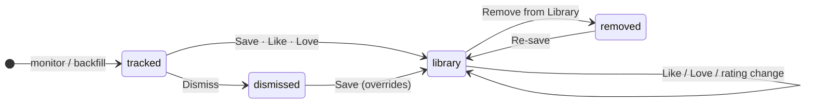

# Paper lifecycle

Every paper in ALMa has **two independent state dimensions**. They are
stored as two columns on the `papers` table and they never overload
each other.

## Membership axis

The `papers.status` column holds one of four mutually-exclusive
values:

| Value | Meaning | UI surfaces |
|---|---|---|
| `tracked` | ALMa knows about this paper but you haven't curated it. Default state for anything pulled from a monitor or a backfill. | Feed, Discovery candidates, Corpus Explorer |
| `library` | You have explicitly **saved** this paper. It is part of your curated collection. | Library tabs |
| `dismissed` | You explicitly hid this from Discovery. Discovery will not re-suggest it. | Hidden everywhere by default; visible in Corpus Explorer |
| `removed` | You used to have this in your Library and chose to remove it. The row is preserved for provenance and as a negative signal. | Hidden by default; visible in Corpus Explorer |

Removal is a **soft transition**, not a hard delete (
[why](../vision.md#design-principles)). The row stays so that
Discovery knows you've explicitly rejected it and so that Insights
counts stay coherent.

## Reading axis

The `papers.reading_status` column holds one of four values
(empty string = none):

| Value | Meaning |
|---|---|
| *(none)* | Default. Reading workflow has nothing to say about this paper. |
| `reading` | You're actively reading it. |
| `done` | You've finished reading it. |
| `excluded` | You evaluated and decided not to read it. Distinct from `dismissed` (membership), which means "don't suggest". |

The reading axis is **independent of membership**. A paper in your
Reading list does not have to be in your Library — you can queue
something for reading while still deciding whether to keep it.

## Why two axes

The most common UI failure in literature tools is conflating "I keep
this paper" with "I have read this paper" with "I rate this paper
highly". The three are independent:

* You can have an unread paper in your Library that you haven't
  rated yet.
* You can finish reading a paper without saving it.
* You can rate a paper without reading it (you've decided it looks
  promising).

Splitting the axes means each control in the UI has exactly one job.
The Reading status select sets `reading_status`. The Save button
sets `status='library'`. The star rating sets `rating`. None of them
touch the others.

## Rating

The third small piece of state is `papers.rating` — an integer 0–5
that ALMa derives from the rating verb you used when saving:

| Verb | Resulting rating |
|---|---|
| **Save** (or **Add**) | 3 |
| **Like** | 4 |
| **Love** | 5 |
| **Dislike** | 1 |

* Ratings 1–2 are **negative signals** for the recommender.
* Rating 3 is neutral / minimally positive.
* Rating 4 is a **+1** positive signal.
* Rating 5 is a **+2** positive signal.

The rating is **monotonic** when re-saving: re-saving a Loved (5)
paper with a plain Save will not downgrade it to 3. Only an explicit
Dislike or a manual rating change can lower it.

## How states transition

Reading transitions are completely orthogonal to the diagram above.

## What this means for the UI

* **Feed** shows `tracked` papers from your monitors. Saving a Feed
  paper transitions it to `library`. Disliking it writes a negative
  signal but **keeps it visible** (Feed is chronological — it does
  not hide things).
* **Discovery** shows `tracked` candidates the recommender thinks you
  haven't seen. Dismissing a Discovery paper writes a negative signal
  **and** hides it from the lens. Saving it transitions to `library`.
* **Library** shows `library` papers. Removing transitions to
  `removed`.
* **Reading list** shows papers with `reading_status='reading'` —
  regardless of membership.
* **Corpus Explorer** (Settings → Data & system) shows everything
  including `dismissed` and `removed`, with the full state visible.

## Where to read more

* [Library](library.md) — the curated surface
* [Feed](feed.md) — the chronological inbox
* [Discovery](discovery.md) — the recommender
* [Vision & philosophy](../vision.md) — why the model is shaped this way
