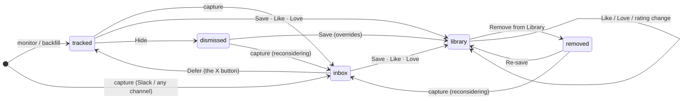

# Paper lifecycle

Every paper in ALMa has **two independent state dimensions**. They are
stored as two columns on the `papers` table and they never overload
each other.

## Membership axis

The `papers.status` column holds one of five mutually-exclusive
values:

| Value | Meaning | UI surfaces |
|---|---|---|
| `tracked` | ALMa knows about this paper but you haven't curated it. Default state for anything pulled from a monitor or a backfill. | Feed, Discovery candidates, Corpus Explorer |
| `inbox` | You **sent this to yourself** from another channel and haven't triaged it. A buffer between `tracked` and `library` — see [Inbox](inbox.md). | Home Inbox section |
| `library` | You have explicitly **saved** this paper. It is part of your curated collection. | Library tabs |
| `dismissed` | The **global hide**: don't surface this anywhere. Visibility only — it carries no opinion (see below). | Hidden everywhere by default; visible in Corpus Explorer |
| `removed` | You used to have this in your Library and chose to remove it. The row is preserved for provenance and as a negative signal. | Hidden by default; visible in Corpus Explorer |

Removal is a **soft transition**, not a hard delete (
[why](../vision.md#design-principles)). The row stays so that
Discovery knows you've explicitly rejected it and so that Insights
counts stay coherent.

### Colour is valence, membership is not (D6, amended 2026-07-26)

Four verbs move a paper, and they answer **different questions**. The word
"dismiss" used to answer all of them at once — it set `status='dismissed'`,
stamped `rating=1` and wrote a negative feedback event — so "I've dealt with
this" was indistinguishable from "this is bad".

| Verb | Axis | Scope | Writes |
|---|---|---|---|
| `save` / `like` / `love` / `dislike` | **valence** | global — one opinion per paper | `rating` + a `feedback_events` row |
| `dismiss` | **resolution** | **the surface that raised it** | that surface's row only. No rating, no event, no lens signal. |
| `defer` | **membership** | the Inbox | `inbox` → `tracked`. Nothing else. |
| `remove` | **membership** | global | `status='removed'` — still a negative (D3) |

Consequences worth knowing:

* **Dismissing in one Discovery lens does not mute the paper in any other.**
  The cooldown is scoped `WHERE lens_id = ?`; previously one dismiss suppressed
  the paper everywhere.
* **`status='dismissed'` carries no valence.** It is the global *hide* — a
  visibility choice. It is not in `signal_valence.NEGATIVE_STATUSES`, so tidying
  your surfaces cannot poison a paper's map colour.
* **Negative opinion is `dislike`.** "Bad and gone" is dislike **plus** dismiss:
  two verbs, composed deliberately.
* **`defer` is not a verdict**, it is the absence of one — which is why the
  Inbox X button cannot reuse `dismiss`.

## Reading axis

The `papers.reading_status` column holds one of four values
(empty string = none):

| Value | Meaning |
|---|---|
| *(none)* | Default. Reading workflow has nothing to say about this paper. |
| `reading` | You're actively reading it. |
| `done` | You've finished reading it. |
| `excluded` | You evaluated and decided not to read it. Distinct from `dismissed` (membership), which means "don't suggest". |

The reading axis is **independent of membership**. A paper in your
Reading list does not have to be in your Library — you can queue
something for reading while still deciding whether to keep it.

## Why two axes

The most common UI failure in literature tools is conflating "I keep
this paper" with "I have read this paper" with "I rate this paper
highly". The three are independent:

* You can have an unread paper in your Library that you haven't
  rated yet.
* You can finish reading a paper without saving it.
* You can rate a paper without reading it (you've decided it looks
  promising).

Splitting the axes means each control in the UI has exactly one job.
The Reading status select sets `reading_status`. The Save button
sets `status='library'`. The star rating sets `rating`. None of them
touch the others.

## Rating

The third small piece of state is `papers.rating` — an integer 0–5
that ALMa derives from the rating verb you used when saving:

| Verb | Resulting rating |
|---|---|
| **Save** (or **Add**) | 3 |
| **Like** | 4 |
| **Love** | 5 |
| **Dislike** | 1 |

* Ratings 1–2 are **negative signals** for the recommender.
* Rating 3 is neutral / minimally positive.
* Rating 4 is a **+1** positive signal.
* Rating 5 is a **+2** positive signal.

The rating is **monotonic** when re-saving: re-saving a Loved (5)
paper with a plain Save will not downgrade it to 3. Only an explicit
Dislike or a manual rating change can lower it.

## How states transition

```mermaid
stateDiagram-v2
    direction LR
    [*] --> tracked: monitor / backfill
    [*] --> inbox: capture (Slack / any channel)
    tracked --> inbox: capture
    inbox --> library: Save · Like · Love
    inbox --> tracked: Defer (the X button)
    tracked --> library: Save · Like · Love
    tracked --> dismissed: Hide
    library --> removed: Remove from Library
    removed --> library: Re-save
    removed --> inbox: capture (reconsidering)
    dismissed --> library: Save (overrides)
    dismissed --> inbox: capture (reconsidering)
    library --> library: Like / Love / rating change
```

A capture never demotes a `library` paper — re-sending something you already
saved is reported as a duplicate and the row is left untouched.

Reading transitions are completely orthogonal to the diagram above.

## What this means for the UI

* **Feed** shows `tracked` papers from your monitors. Saving a Feed
  paper transitions it to `library`. Disliking it writes a negative
  signal but **keeps it visible** (Feed is chronological — it does
  not hide things).
* **Discovery** shows `tracked` candidates the recommender thinks you
  haven't seen. Dismissing hides that recommendation in its lens without
  changing preference. Saving transitions to `library`.
* **Home** shows the [Inbox](inbox.md) — papers you sent yourself from
  another channel. Triage moves them to `library`, or the X button
  (`defer`) drops them back to `tracked` writing no signal at all.
* **Library** shows `library` papers. Removing transitions to
  `removed`.
* **Reading list** shows papers with `reading_status='reading'` —
  regardless of membership.
* **Corpus Explorer** (Settings → Data & system) shows everything
  including `dismissed` and `removed`, with the full state visible.

## Where to read more

* [Library](library.md) — the curated surface
* [Feed](feed.md) — the chronological inbox
* [Discovery](discovery.md) — the recommender
* [Vision & philosophy](../vision.md) — why the model is shaped this way
