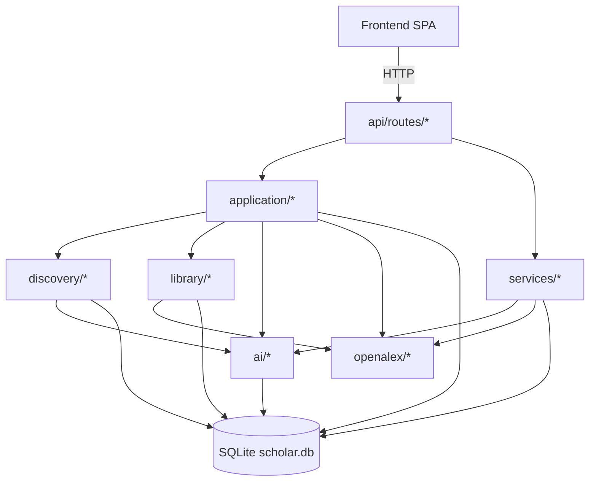

# Architecture

ALMa is a small system. The whole backend is one FastAPI app, the
whole frontend is one Vite SPA, and the whole datastore is one
SQLite file.

## Top-level layout

```
alma/
├── src/alma/                     # Python backend
│   ├── api/                      # FastAPI app, routes, models, deps
│   │   ├── app.py                # App factory, middleware, lifespan
│   │   ├── deps.py               # DB connections, schema bootstrap
│   │   ├── models.py             # Pydantic request / response models
│   │   ├── helpers.py            # Shared helpers (raise_internal, row_to_paper_response)
│   │   └── routes/               # 29 route modules, one per domain
│   ├── application/              # Application-layer use-cases
│   │   └── discovery/            # Discovery use-case package (lenses, seeds, scoring, retrieval)
│   ├── core/                     # Shared utilities (text normalisation, etc.)
│   ├── discovery/                # Source clients + recommendation engine, scoring, similarity
│   ├── library/                  # Importers, deduplication, enrichment
│   ├── ai/                       # Embedding providers and dependency probes
│   ├── openalex/                 # OpenAlex HTTP client + helpers
│   ├── services/                 # Thin domain services (S2 vectors, signal lab)
│   ├── plugins/                  # Plugin layer (Slack)
│   ├── cli/                      # `alma` CLI entry point
│   └── config.py                 # Centralised configuration loading
│
├── frontend/                     # React 19 + Vite + Tailwind SPA
│   └── src/
│       ├── pages/                # 8 top-level pages
│       ├── components/           # Shared and per-feature components
│       ├── hooks/                # React hooks
│       ├── lib/                  # Frontend utilities
│       └── api/client.ts         # Single API client + type definitions
│
├── tests/                        # pytest test suite
├── docs/                         # This documentation
├── data/                         # SQLite + caches (gitignored)
├── settings.json                 # Runtime preferences
└── pyproject.toml
```

## Layered organisation



* **Routes** — thin HTTP layer. Validate request, call into
  application / services, format response. No business logic.
* **Application** — use-cases. `add_to_library`, `apply_follow_state`,
  `record_feedback`, `save_online_search_result`. Each is a single
  intent, called by exactly one (or a small number of) routes.
* **Services** — domain services that span multiple use-cases
  (signal lab, S2 vectors).
* **Domain modules** — `discovery/`, `library/`, `ai/`, `openalex/`
  encapsulate their own state, helpers, and external-API contracts.

### Two discovery locations

The word "discovery" names **two distinct packages** — they are not the
same layer:

* **`src/alma/discovery/`** (top-level domain module) — the source
  clients and the recommendation **engine**. HTTP clients
  (`arxiv.py`, `biorxiv.py`, `crossref.py`, `semantic_scholar.py`,
  `orcid.py`, `openalex_related.py`), the `engine.py` recommendation
  engine, `scoring.py`, `similarity.py`, `source_search.py`, and
  `defaults.py`. This is the `discovery/*` node in the flowchart above.
* **`src/alma/application/discovery/`** (application-layer use-case
  package) — the refresh use-case that orchestrates a Discovery run.
  Formerly one monolithic `application/discovery.py`; split into a
  package in **D-9**. Every public name is still re-exported from
  `alma.application.discovery`, so callers and the
  [single-intent table](#single-intent-per-action) below are
  unaffected.

The application-layer package lays out as:

```
src/alma/application/discovery/
├── __init__.py        # Refresh orchestrator + the re-export surface
├── lens_crud.py       # Settings / recommendations / lenses / lens-signals /
│                      #   branch lifecycle, plus row ↔ JSON mapping
├── seed_profile.py    # Seed loading, library preference profiling,
│                      #   branch building, branch-query planner
├── scoring_loop.py    # Per-candidate scoring pass (ScoringContext, score_candidates)
└── retrieval/         # Candidate-retrieval channels + channel merge
    ├── __init__.py    # Re-exports every channel + merge helper
    ├── _common.py     # Candidate keying, future-draining helpers
    ├── merge.py       # Channel merge, diversity selection, mix summary
    ├── lexical.py     # Lexical retrieval channel
    ├── vector.py      # Vector (embedding) retrieval channel
    ├── graph.py       # Citation-graph retrieval channel
    └── external.py    # External-source retrieval channel
```

## Shared Ranking Signals

Paper Discovery and author suggestions share a feedback projection
layer in `alma.application.signal_projection`.

That module reads canonical `feedback_events` paper actions from both
`entity_type='publication'` and older `entity_type='paper'` rows,
normalizes each event into a signed value, applies time decay, and
projects it onto related ranking dimensions:

* paper id
* author OpenAlex ids and author display names
* topics
* venues
* extracted keywords
* user tags
* close semantic neighbours from active-model `publication_embeddings`
* local incoming / outgoing citation neighbours from `publication_references`

Consumers must treat these maps as ranking input only. They must not
change paper lifecycle state, follow/unfollow authors, or write from a
`GET` endpoint. Current consumers are:

| Consumer | Use |
|---|---|
| `discovery.scoring.compute_preference_profile` / `score_candidate` | Adds `projected_feedback_raw` into the existing `feedback_adj` signal. |
| `application.authors.list_author_suggestions` | Applies capped `paper_signal_adjustment` before dismissed-author cluster penalties. |
| `application.paper_signal.score_papers_batch` | Reads the same canonical paper-action payloads for network author bucket seed scoring. |

The projection layer also reads `followed_authors` as positive author
signals and `missing_author_feedback` as negative author signals, then
spills those author profiles weakly into paper-ranking topics, venues,
keywords, and tags — plus the followed/rejected author's direct
coauthors and same-institution colleagues (the latter capped to
≤400-author institutions). It also folds `papers.rating` (Library
star ratings, no time decay) and `recommendations.user_action`
(suggestion-resolution history plus legacy per-rec feedback,
age-decayed) into `paper_events` before projection runs, so every
per-paper preference statement reaches the same downstream graph.
Current Discovery like / love / dislike actions write ratings and
feedback events but do not resolve the recommendation row; save,
read, and dismiss do.

### Shared scoring primitives

`alma.core.scoring_math` consolidates four primitives previously
duplicated across `discovery.scoring`, `application.signal_projection`,
`application.authors`, `application.discovery`, `application.feed`,
`application.gap_radar`, `application.paper_signal`, and
`discovery.source_search`:

* `clamp(value, lo, hi)` — bounded projection
* `age_decay(age_days, half_life_days)` — exponential half-life decay
* `consensus_bonus(n, fraction, max_score)` — diminishing-returns
  multi-source bonus, used by paper Discovery's per-candidate
  consensus and the author rail's per-bucket consensus alike
* `log_prevalence_weights(counts)` — sign-preserving log-prevalence
  normalization, used by paper Discovery's topic / venue / **author**
  weighting (added 2026-05) and the author rail's library prevalence.
  Author affinity used to be linear-max-normalized, which let one
  dominant author crowd the long tail; log-prevalence flattens this.

Calibration constants live at the call site; the math lives once.
A change to `consensus_bonus`'s curve takes effect on both Discovery
and the author rail without extra plumbing.

### Branch auto-lifecycle

`application.discovery._apply_branch_auto_lifecycle` runs after
`_enrich_branches_with_outcomes` and before retrieval. It maps each
branch's `auto_weight` to a state:

* `auto_weight ≤ 0.65` → **rotated**: `core_topics` and
  `explore_topics` swapped on the branch dict. Self-correcting on
  the next refresh because the swap is recomputed every time.
* `auto_weight ≤ 0.55` → **auto-muted**: `is_active=False`,
  external lane skips it.

User-set pin / boost wins over both. The transformation is pure
(no DB writes), so retraction is instantaneous when the user
adjusts a control or auto_weight recovers.

`_enrich_branches_with_outcomes` and `_apply_branch_controls` both
fall back to a **lineage match**: when the current cluster's seed
set overlaps ≥ 70 % with a previous branch's seed set, the past
branch's calibration history (and its pin / mute / boost flags)
are inherited, so K-means reshuffles don't silently orphan a
user's accumulated curation.

### Outcome calibration

`alma.application.outcome_calibration` smooths observed save / dismiss
outcomes into per-source quality multipliers via a Beta-Bernoulli
posterior (α = β = 2) over a 180-day window with a 60-day half-life
decay. Paper Discovery uses three independent axes — `source_api`,
`branch_mode`, `branch_id` — composed multiplicatively in log space
and clamped to `[0.5, 1.5]`, applied to `source_relevance` per
candidate. The author rail uses a fourth axis — per-bucket calibration
keyed on `suggestion_type`, fed by `author_suggestion_follow_log` and
the `suggestion_bucket` column on `missing_author_feedback`. Empty
maps on a fresh DB return 1.0 multipliers — no behavior change until
real outcome data accumulates.

## Single intent per action

Every user action maps to exactly one canonical use-case. Examples:

| User action | Canonical helper |
|---|---|
| Save a paper from any surface | `alma.application.library.add_to_library` |
| Add a Discovery recommendation to Reading list | `alma.application.discovery.mark_recommendation_action(..., "read")` |
| Follow / unfollow an author | `alma.application.authors.apply_follow_state` |
| Save an online search result | `alma.application.openalex_manual.save_online_search_result` |
| Write a feedback event | `alma.services.signal_lab.record_feedback` |
| Promote an existing tracked paper into Library | `alma.application.library.add_to_library` (same) |

Two routes that mean the same thing always call the same helper.
This is the [one intent per action](../vision.md#one-intent-per-action)
principle in code.

## Reads vs writes

A hard rule:

* **`GET` endpoints never write.** No mirror-table syncs on a
  `GET /feed` or `GET /authors`. Mirror syncs run on the mutation
  paths only.
* **`POST` / `PUT` / `DELETE` may write to multiple tables**, but
  always in one DB transaction.

The cost of a violation is silent state drift between read and
write paths — caught by the
[same-shape regression rule](#same-shape-rule) below.

## Same-shape rule

Whenever a single response carries both a summary count and a list
of the underlying objects, both are computed from the **same join
shape**. Two independent queries with subtly different joins
produce a header count that doesn't match the list length, which
is a class of bug worth designing out.

The fix when you spot it: derive the count from
`SELECT COUNT(*) FROM (<list query>)` rather than running two
queries.

## Activity envelope

Long jobs return a job envelope, run in the scheduler worker, and
report status via `/api/v1/activity`. No long jobs run inline in
request handlers — pinned by tests.

See [Background jobs](../operations/background-jobs.md).

## Database layer

* **One file**, `data/scholar.db`. WAL mode.
* **Schema migration** runs on every backend start. Adds missing
  columns / tables; never drops anything destructive.
  `api.deps.init_db_schema()` is the **single source of truth** for
  creating columns — e.g. the six `recommendations` provenance columns
  (`source_type`, `source_api`, `source_key`, `branch_id`,
  `branch_label`, `branch_mode`) are created here at startup (D-10).
  Hot paths are **forward-only**: they assume the current shape and
  carry no inline `ALTER … ADD COLUMN` guards. The per-refresh ALTER
  guard the Discovery refresh once ran was removed once startup owned
  the columns — consistent with the project's *forward-only code,
  decoupled validators + migrators* principle.
* **`check_same_thread=False`** is required on FastAPI sync
  generator deps. Pinned by lessons.
* **No ORM**. Routes use raw SQLite via thin helpers in
  `alma/api/deps.py`. Keeps the schema explicit and queries
  inspectable.

### Concurrency & write contention

SQLite allows **one writer at a time** (readers run concurrently under
WAL). ALMa is a single backend process where foreground HTTP requests and
background jobs share that one writer, so a burst of work can collide as
`database is locked` if left unmanaged. Five mechanisms prevent it:

* **One connection contract** — `alma.api.deps.open_db_connection` is the
  single factory. Every connection sets `journal_mode=WAL`,
  `busy_timeout=30000` (wait up to 30 s for the writer rather than failing
  instantly), `synchronous=NORMAL` (safe under WAL; far fewer fsyncs, so a
  write transaction is held briefly), and `foreign_keys=ON`. WAL is
  re-asserted **and read back** on every open — if the filesystem refuses
  WAL (some network / overlay mounts), a warning is logged instead of
  silently degrading to a reader-blocking rollback journal. Background
  runners that once rolled their own `sqlite3.connect` (preprint dedup,
  fetcher, settings export, discovery engine) carry the same pragmas.
* **Bounded background concurrency** — `scheduler.get_scheduler` pins
  APScheduler to `ThreadPoolExecutor(max_workers=ALMA_SCHEDULER_WORKERS)`
  (default 5, was the library default of 10) with `max_instances=1,
  coalesce=True`. Without it, a burst of user actions — each follow chains
  backfill → corpus rehydrate → s2 → embeddings — saturated the writer and
  starved foreground clicks. The cap is the core fix; it's CPU-throttled
  Docker hosts that surfaced it (a write held longer than on bare metal).
* **Foreground lock-retry** — `core.db_retry.run_with_lock_retry` wraps the
  write+commit of single-intent user actions (follow / unfollow /
  dismiss-suggestion / create-author / author merge) and retries on a
  transient lock with `rollback()` first, so a brief lock never silently
  drops a click. The rollback-first matters: a retry must re-issue the
  writes on a clean transaction, and nothing else may be staged on that
  connection before the retried block (e.g. `create_author` commits its
  column-ensure first; the merge runs as one atomic transaction).
* **Why Feed/Discovery paper actions are *not* wrapped** — they funnel
  through `library.add_to_library` **and** `signal_lab.record_feedback`,
  which each `commit()` internally and **append** non-idempotent rows. One
  action is therefore a *sequence* of separate commits, not a single atomic
  unit, so a blind re-run would double-record a signal. They rely on the
  busy_timeout + the worker cap instead. Giving them the same retry would
  require making each action one transaction first (defer the inner
  commits) — a refactor, not a drop-in.
* **Fetch/write decoupling for network sweeps** — per-item network jobs
  (identity resolution, abstract recovery) run through
  `core.fetch_pipeline.run_fetch_write_pipeline`: a bounded concurrent pool
  does the network (no DB access; clamped to the job's `fanout_budget`) and a
  single writer thread batches the `write_section` flushes. This makes the
  "never hold the writer across a network call" rule **structural** — the
  writer gate is taken only for the brief, batched local write, never while a
  remote round-trip is in flight — and turns a ~1-paper/s serial loop into a
  concurrent one. The writer stays on the job thread, so cancellation (which
  hard-kills that thread) and the single-writer invariant are preserved.

The activity/log connection (`scheduler._activity_conn`) intentionally uses
a shorter `busy_timeout` (5 s) — status writes are best-effort and must stay
snappy — but no longer the original 250 ms, which dropped status rows under
load. Full rationale in `tasks/lessons.md` → "SQLite single-writer".

## Materialised views (cached read aggregates)

Endpoints that produce expensive payloads — `/insights` and the
three graph endpoints — are served via a fingerprint-keyed cache in
`alma.application.materialized_views`, backed by the
`materialized_views` table (`view_key PK, fingerprint, payload,
computed_at, …`).

The contract is **pull-based stale-while-revalidate**:

1. Each registered view declares a `fingerprint_sql` — a single
   SELECT returning a tuple of values that change iff the rendered
   payload should change (typically a handful of `MAX(updated_at)`
   / `COUNT(*)` selects across the tables the build reads).
2. On GET, the layer computes the current fingerprint (~5 ms) and
   compares it to the cached row's fingerprint.
3. **Match** → return the cached payload.
4. **Mismatch** → return the cached payload with `stale: true,
   rebuilding: true`, enqueue a background rebuild via APScheduler
   under the view's `operation_key` (e.g.
   `materialize.graph.paper_map.library`; deduped, so concurrent
   GETs collapse to one running job).
5. **No row yet** → build synchronously this once.
6. **Build failure with a stale row available** → serve the stale
   row and log; never 5xx.

Writers don't know views exist. The fingerprint check on every GET
catches every mutation (imports, lens refreshes, follow changes,
paper edits) without coupling writers to views. If profiling ever
shows the 5 ms cost matters for a hot endpoint, add an explicit
`mv.invalidate(view_key)` helper and call it from the write path;
the helper isn't implemented today because we haven't needed it.

Six views registered today: `insights:overview`,
`graph:paper_map:{library,corpus}`,
`graph:author_network:{library,corpus}`, `graph:topic_map`. To add
a new one, call `mv.register(View(...))` at module load and add a
branch to `frontend/src/hooks/useOperationToasts.ts`'s
`rootsForOperation` so the matching React Query roots refetch when
the rebuild completes. See `tasks/lessons.md` ("Materialised-view
caching: fingerprint, not TTL") for the design rationale.

## Frontend ↔ backend boundary

* The frontend sees one API surface: `frontend/src/api/client.ts`
  defines every endpoint and its TypeScript type.
* Hash routing — `lib/hashRoute.ts` (no React Router). Simple
  enough for a small app; lets the SPA work behind any reverse
  proxy without server-side route awareness.
* The SPA catch-all route in `app.py` MUST be the last route
  registered (it serves `index.html` for any path the API doesn't
  match).

## Where to add a new feature

* **A new endpoint on an existing domain** → `api/routes/<domain>.py`
  + a helper in `application/` if it has logic worth naming.
* **A new domain entirely** → new `api/routes/<thing>.py`, register
  in `app.py`, add tables to the schema bootstrap, write
  `application/<thing>.py` for the use-cases.
* **A new external source** → `<source>/client.py` for the HTTP
  client, plug it into `discovery/source_search.py` or wherever
  the multi-source fan-out lives.
* **A new AI provider** → `ai/providers.py` for embeddings. Add it
  to the dependency probe.

The tests document the contract for each layer; if you add a
behaviour, add a test that pins it.
