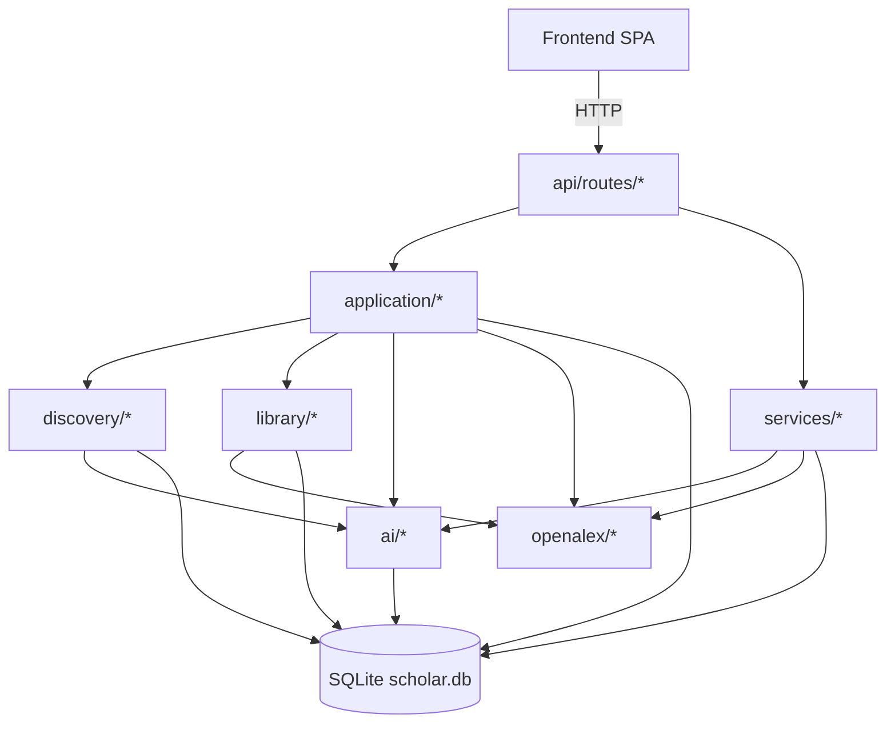

# Architecture

ALMa is a small system. The whole backend is one FastAPI app, the
whole frontend is one Vite SPA, and the whole datastore is one
SQLite file.

## Top-level layout

```
alma/
├── src/alma/                     # Python backend
│   ├── api/                      # FastAPI app, routes, models, deps
│   │   ├── app.py                # App factory, middleware, lifespan
│   │   ├── deps.py               # DB connections, schema bootstrap
│   │   ├── models.py             # Pydantic request / response models
│   │   ├── helpers.py            # Shared helpers (raise_internal, row_to_paper_response)
│   │   └── routes/               # 25 route modules, one per domain
│   ├── application/              # Application-layer use-cases
│   ├── core/                     # Shared utilities (text normalisation, etc.)
│   ├── discovery/                # Recommendation engine, scoring, similarity
│   ├── library/                  # Importers, deduplication, enrichment
│   ├── ai/                       # Embedding providers and dependency probes
│   ├── openalex/                 # OpenAlex HTTP client + helpers
│   ├── services/                 # Thin domain services (S2 vectors, signal lab)
│   ├── plugins/                  # Plugin layer (Slack)
│   ├── cli/                      # `alma` CLI entry point
│   └── config.py                 # Centralised configuration loading
│
├── frontend/                     # React 19 + Vite + Tailwind SPA
│   └── src/
│       ├── pages/                # 8 top-level pages
│       ├── components/           # Shared and per-feature components
│       ├── hooks/                # React hooks
│       ├── lib/                  # Frontend utilities
│       └── api/client.ts         # Single API client + type definitions
│
├── tests/                        # pytest test suite
├── docs/                         # This documentation
├── data/                         # SQLite + caches (gitignored)
├── settings.json                 # Runtime preferences
└── pyproject.toml
```

## Layered organisation



* **Routes** — thin HTTP layer. Validate request, call into
  application / services, format response. No business logic.
* **Application** — use-cases. `add_to_library`, `apply_follow_state`,
  `record_feedback`, `save_online_search_result`. Each is a single
  intent, called by exactly one (or a small number of) routes.
* **Services** — domain services that span multiple use-cases
  (signal lab, S2 vectors).
* **Domain modules** — `discovery/`, `library/`, `ai/`, `openalex/`
  encapsulate their own state, helpers, and external-API contracts.

## Single intent per action

Every user action maps to exactly one canonical use-case. Examples:

| User action | Canonical helper |
|---|---|
| Save a paper from any surface | `alma.application.library.add_to_library` |
| Follow / unfollow an author | `alma.application.authors.apply_follow_state` |
| Save an online search result | `alma.application.openalex_manual.save_online_search_result` |
| Write a feedback event | `alma.services.signal_lab.record_feedback` |
| Promote an existing tracked paper into Library | `alma.application.library.add_to_library` (same) |

Two routes that mean the same thing always call the same helper.
This is the [one intent per action](../vision.md#one-intent-per-action)
principle in code.

## Reads vs writes

A hard rule:

* **`GET` endpoints never write.** No mirror-table syncs on a
  `GET /feed` or `GET /authors`. Mirror syncs run on the mutation
  paths only.
* **`POST` / `PUT` / `DELETE` may write to multiple tables**, but
  always in one DB transaction.

The cost of a violation is silent state drift between read and
write paths — caught by the
[same-shape regression rule](#same-shape-rule) below.

## Same-shape rule

Whenever a single response carries both a summary count and a list
of the underlying objects, both are computed from the **same join
shape**. Two independent queries with subtly different joins
produce a header count that doesn't match the list length, which
is a class of bug worth designing out.

The fix when you spot it: derive the count from
`SELECT COUNT(*) FROM (<list query>)` rather than running two
queries.

## Activity envelope

Long jobs return a job envelope, run in the scheduler worker, and
report status via `/api/v1/activity`. No long jobs run inline in
request handlers — pinned by tests.

See [Background jobs](../operations/background-jobs.md).

## Database layer

* **One file**, `data/scholar.db`. WAL mode.
* **Schema migration** runs on every backend start. Adds missing
  columns / tables; never drops anything destructive.
* **`check_same_thread=False`** is required on FastAPI sync
  generator deps. Pinned by lessons.
* **No ORM**. Routes use raw SQLite via thin helpers in
  `alma/api/deps.py`. Keeps the schema explicit and queries
  inspectable.

## Frontend ↔ backend boundary

* The frontend sees one API surface: `frontend/src/api/client.ts`
  defines every endpoint and its TypeScript type.
* Hash routing — `lib/hashRoute.ts` (no React Router). Simple
  enough for a small app; lets the SPA work behind any reverse
  proxy without server-side route awareness.
* The SPA catch-all route in `app.py` MUST be the last route
  registered (it serves `index.html` for any path the API doesn't
  match).

## Where to add a new feature

* **A new endpoint on an existing domain** → `api/routes/<domain>.py`
  + a helper in `application/` if it has logic worth naming.
* **A new domain entirely** → new `api/routes/<thing>.py`, register
  in `app.py`, add tables to the schema bootstrap, write
  `application/<thing>.py` for the use-cases.
* **A new external source** → `<source>/client.py` for the HTTP
  client, plug it into `discovery/source_search.py` or wherever
  the multi-source fan-out lives.
* **A new AI provider** → `ai/providers.py` for embeddings. Add it
  to the dependency probe.

The tests document the contract for each layer; if you add a
behaviour, add a test that pins it.
