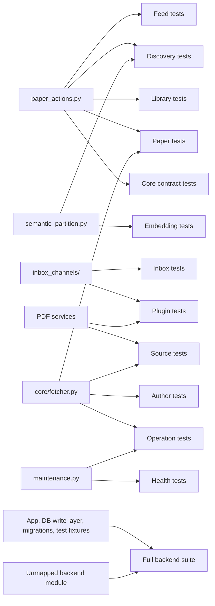

# Backend test dependency graph

`scripts/test_groups.toml` is the executable graph. Each group lists source
patterns and test-file patterns. A test can appear in several groups; the runner
deduplicates it before execution. Generate the complete graph with:

```bash
python scripts/test_local.py graph --format dot > /tmp/alma-test-dependencies.dot
dot -Tsvg /tmp/alma-test-dependencies.dot > /tmp/alma-test-dependencies.svg
```

`--format json` prints the same group edges plus each test file's direct ALMa
and test-helper imports for inspection or other graph tools.
The graph is generated from the exact rules used by `changed`; this document
shows its most important shared paths.



Every selected file runs once, assigned to one of four separate pytest
processes. Each process has its own settings/secrets directory and pytest
`tmp_path` databases. `--workers 1` makes the same selection serial for
debugging. The graph is intentionally conservative: it maps components and
contracts, including indirect behavior that an import-only graph would miss.
The full suite remains the merge and release gate.

Run `python scripts/test_local.py check` after adding a test file; it fails if
no group owns it. An unmapped source path triggers the full suite, making a
new module expensive until someone records its dependencies instead of silently
skipping tests.
