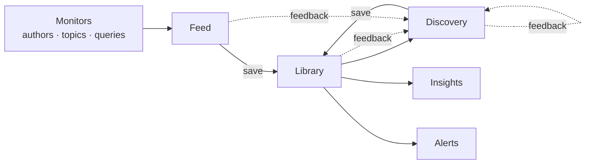

# ALMa

**A**nother **L**ibrary **M**anager — a personal, self-hosted academic
literature monitor.

ALMa watches the publication record on your behalf, surfaces new work
from the people and topics you care about, recommends adjacent papers
you haven't seen, and maintains the curated library that anchors all
of it. One user, one machine, one SQLite file.

-   :material-rocket-launch:{ .lg .middle } **Get started in 5 minutes**

    ---

    Install, point ALMa at OpenAlex, and follow your first author.

    [:octicons-arrow-right-24: Installation](getting-started/installation.md)

-   :material-compass:{ .lg .middle } **Understand the model**

    ---

    Feed, Library, and Discovery are three views of the same paper
    lifecycle. Read this once, the rest of the UI clicks into place.

    [:octicons-arrow-right-24: Vision & philosophy](vision.md)

-   :material-book-open-variant:{ .lg .middle } **Browse concepts**

    ---

    What each surface does, what it doesn't, and how they hand off
    work to each other.

    [:octicons-arrow-right-24: Concepts](concepts/index.md)

-   :material-api:{ .lg .middle } **Use the REST API**

    ---

    Every endpoint ALMa exposes, grouped by domain, with live Swagger
    UI for try-it-yourself.

    [:octicons-arrow-right-24: REST API](reference/api.md)

## What ALMa is

A **personal** research feed — designed for one user with their own
literature, not a multi-tenant SaaS. ALMa runs entirely on your
machine, stores everything in one SQLite file (`data/scholar.db`),
and only talks to the outside world when it's fetching a paper or a
profile from a public source.

It pulls primarily from [OpenAlex](https://openalex.org/) and
[Semantic Scholar](https://www.semanticscholar.org/), with optional
fall-throughs to Crossref, arXiv, bioRxiv, and Google Scholar
(`scholarly`) for author resolution. Embedding-based discovery is
opt-in and uses [SPECTER2](https://huggingface.co/allenai/specter2_base)
either via Semantic Scholar's pre-computed vectors or a local
fall-back.

## What ALMa is not

* **Not a citation manager.** It doesn't replace Zotero or Mendeley.
  It imports from them so the work you've already curated becomes
  the seed for discovery.
* **Not a multi-user platform.** There is no auth, no permissions,
  no sharing — by design.
* **Not a SaaS.** You host it yourself. The only network calls are
  to public scholarly APIs and (optionally) AI providers you
  configure.
* **Not a search engine.** It's a *recommendation* engine over a
  curated personal corpus. Search is a side effect, not the point.

## How the parts fit together

Monitors generate the **Feed** (chronological, deterministic). Saving
from the Feed grows the **Library** (curated, organised). Discovery
recommends papers adjacent to the Library (probabilistic, ranked).
Every save, rating, dismissal, and tracked interaction strengthens the
feedback loop that tunes Discovery over time. **Insights** projects the
Library into charts and a clustered SPECTER2 graph. **Alerts** turns
rules into Slack digests.

## License

[CC BY-NC 4.0](https://creativecommons.org/licenses/by-nc/4.0/) ©
Andrea Ivan Costantino. Personal and academic use are free; academic
use requires a citation. Commercial use is not permitted.
