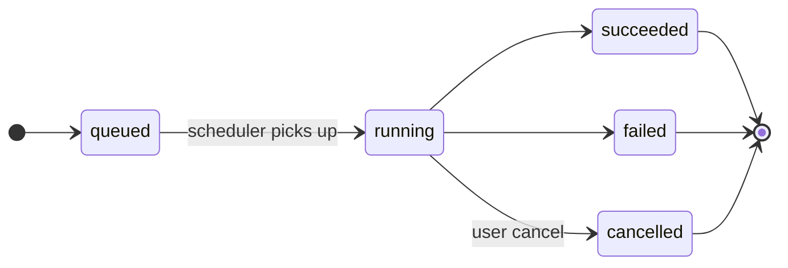

# Background jobs

Anything that takes more than a couple of seconds runs as a
**background job** — queued in APScheduler, executed in a worker
thread, surfaced in the Activity panel.

This page documents the contract.

## The Activity envelope

A long-running endpoint returns immediately with a JSON envelope:

```json
{
  "job_id": "f3b2a4e8-…",
  "status": "queued",
  "message": "Refresh started; track progress in Activity."
}
```

Possible statuses on creation:

| Status | Meaning |
|---|---|
| `queued` | Job created, scheduler will pick it up. |
| `running` | Job already running (returned synchronously by short paths). |
| `already_running` | Another instance of the same job is already in flight; this call is a no-op. |
| `noop` | Nothing to do (e.g. "no unresolved imports"). |

Once the job is in flight, query `/api/v1/activity/{job_id}` to
poll its state, or watch the Activity panel which subscribes to
status changes.

## Status lifecycle



A job carries:

* **`progress`** — float 0.0–1.0 when measurable, null otherwise.
* **`message`** — short status string, updated as the job
  progresses.
* **`per_source_timing`** — per-source latencies for jobs that
  fan out across external APIs.
* **`logs`** — append-only log stream (queryable at
  `/api/v1/activity/{job_id}/logs`).
* **`terminal_message`** — the final status message, written once
  on completion. Pinned not to leak from in-progress logs.

## Cancellation

For long jobs (lens refresh, deep refresh all, bulk backfill), the
Activity panel shows a Cancel button. It calls
`POST /api/v1/activity/{job_id}/cancel`, which sets a cooperative
flag the job polls between batches.

Cancellation is **cooperative**, not forceful — if a job is in the
middle of an HTTP call to an external API, it'll finish that call
before checking the flag. Expect a few seconds of latency on
cancel.

The scheduler enforces cancellation centrally: once
`cancel_requested=true` is recorded for a job, later progress updates
cannot move it back to `running`, and a job that returns after a
cancel request is finalized as `cancelled` instead of `completed`.
Activity status/log checkpoints also raise a scheduler cancellation
exception, so runners that report progress stop at the next checkpoint.
Individual runners should still check `is_cancellation_requested()`
inside long inner loops and before expensive external calls so they
stop before the next Activity write when possible.

## Concurrency rules

* **Same job, only one instance.** Author refresh, feed refresh,
  lens refresh, bulk backfill all enforce single-instance via a
  job-key lock. A second call returns `already_running`.
* **Different jobs run concurrently — but the pool is bounded.** Up
  to `ALMA_SCHEDULER_WORKERS` (default **5**) background jobs run at
  once; the rest queue. This keeps a burst of heavy jobs from
  starving the app's database writer. Lower it on a small host, raise
  it if you have CPU to spare. (Why it matters:
  [Architecture → Concurrency & write contention](../development/architecture.md#concurrency-write-contention).)
* **Read endpoints don't block on jobs.** `/api/v1/library/saved`,
  `/api/v1/feed`, `/api/v1/authors` stay responsive even during a
  heavy refresh.
* **Typed admission policy.** Every producer is classified in one catalog
  (`core/job_policy.py`) by operation-key namespace — class, priority lane,
  resources, sources, coalescing/durability. A structural test fails CI on any
  unclassified scheduling call.
* **Background work yields to the user** (task 37). One gate
  (`job_policy.admit_maintenance` + `scheduler.may_background_run`) governs every
  background health sweep, checked both when it *starts* and at each continuation
  boundary: it runs only when **no other operation is active** and the app has been
  **idle for 3 minutes** (an in-memory activity clock — no write on a GET), and a
  running sweep **pauses the moment the user acts**, leaving its work queued
  (retryable) for the idle healer to resume. Background provider calls also
  **reserve 200 API calls for the user** (`http_sources.provider_budget_ok` over
  OpenAlex's live `X-RateLimit-Remaining`); a sweep that would cross the floor stops
  gracefully and the Health page reports the remaining credits + the last
  credit-limit abort. Manual user operations never pause and use the full quota.
* **Per-job nested fan-out budget.** `ALMA_SCHEDULER_WORKERS` bounds how many
  jobs run at once; `JobPolicy.fanout_budget` bounds how *wide* each one fans
  out. A job that internally spawns a `ThreadPoolExecutor` (discovery retrieval
  lanes, S2 `/paper/batch`, per-author works expansion, library enrichment) goes
  through `core.concurrency.bounded_thread_pool`, which clamps the pool to the
  running job's budget — so N concurrent jobs can't each open a 12-worker pool
  and storm SQLite / the upstream APIs. The clamp applies **only on the
  background-job path**: interactive request-path fan-out (a user clicking
  Discover / Find & Add) keeps its full width, since there latency, not writer
  contention, is the concern. Latency-sensitive network namespaces
  (discovery/feed/lenses) carry a generous budget; DB-writing namespaces a
  tighter one. A structural test fails CI on any raw `ThreadPoolExecutor(…)`
  outside the one primitive.

## Common job types

| Job | Triggers |
|---|---|
| Author refresh-cache | Per-author manual + nightly scheduler. |
| Author deep-refresh | Per-author manual; deep-refresh-all bulk. |
| Feed refresh | Manual + scheduler (every few hours). |
| Lens refresh | Manual per-lens. Default `LENS_REFRESH_LIMIT = 50` (post-filter target — the backend oversamples internally so 50 actually land); runs four retrieval lanes (lexical, vector, graph, external), each emitted as a **child Activity row** under the parent `lens_refresh_<id>` so per-lane status / duration / failure is visible in the Activity panel. The parent's log carries `lane.{name}.start` and `lane.{name}.completed` markers linking to the subtask via `subtask_job_id`. After retrieval the parent merges by candidate identity (so cross-lane hits accumulate `consensus_count`), scores with the 10-signal hybrid ranker, applies the diversity pass (per-author cap = 2, per-source-key cap ≈ 25 %), then stages survivors. Branches are rebuilt on every refresh and go through the auto-lifecycle pass (rotate when `auto_weight ≤ 0.65`, auto-mute when `≤ 0.55`) before the external lane fans out. |
| Discovery refresh (legacy global) | Manual. |
| Fetch missing S2 vectors | Health → repair cards. |
| Resolve missing identity (title resolution) | Health → repair cards. Title-only papers with no usable identifier are resolved via OpenAlex `/works?search` first, then an S2 `/paper/search` fallback (≤50/run). Runs through the **decoupled multi-source pipeline** (`run_staged_fetch_pipeline`): OpenAlex and the S2 fallback are **two independent stages**, each on its own rate-limited pool, with OpenAlex misses flowing into the S2 stage's queue — so the sources fetch concurrently and an OpenAlex 429 never stalls the S2 stage or the single batched writer. **Time-boxed per outer run** and self-rescheduling, so one click drains an arbitrary backlog in short chunks that survive a `--reload`. Every attempt is ledger-stamped (resolved / sticky `terminal_no_match` / TTL'd retryable) so dead-end titles leave the pool. |
| Compute embeddings (local SPECTER2) | Health → repair cards. |
| Cluster Library | Insights → Graph → Re-cluster. |
| Generate cluster labels | After clustering. |
| Bulk tag suggestions | Library → Tags. |
| BibTeX / Zotero import | Import dialog. |
| OpenAlex resolve | Library → Imports → Resolve. |
| Enrich imports | Library → Imports → Enrich. |
| Preprint dedup | Health → repair cards. |
| Corpus metadata rehydration | Health → repair cards, **and auto-triggered after every paper insert** via a **coalescing dispatcher**. Every insert path — single (Library save, importer, engine, OpenAlex client) and batch (Feed ingest, Discovery staging) — writes a durable per-paper row to the hydration ledger (`enqueue_pending_hydration`) and then schedules **ONE** fixed-key drain (`papers.rehydrate_metadata:openalex:metadata`, `trigger_source="auto:paper_insert"`): N inserts upsert N ledger rows but coalesce onto a single dispatcher via `find_active_job`, **not** N target-scoped jobs (the old per-paper keys produced 1,530-key job storms). No starvation — the OpenAlex selector drains **newest-first**, so a fresh insert is serviced in the first chunk; the auto drain is bounded (25 papers/sweep), while Health/manual runs send an explicit `max_items`. A periodic **hydration-drain tick** (every 15 min, `ALMA_HYDRATION_DRAIN_INTERVAL_MINUTES`) re-schedules the coalescing drain whenever the durable ledger holds pending rows, so work enqueued before a restart resumes under one dispatcher. Five phases per run — Phase 0 (identity resolution for title-only papers) and Phase 3 (OA / landing-page abstract recovery) bracket the three below. **Every per-item network loop runs through a concurrent-fetch → single-batched-writer pipeline** (`core/fetch_pipeline.py`): bounded pools do network only (rate-limited at the source client, clamped to the job's `fanout_budget`) and one writer thread batches the `write_section` flushes — so the writer lock is never held across a network call and a per-paper search loop runs ~4-5× faster than the old serial interleave. **(0) Title resolution** — runs the **decoupled multi-source pipeline** (`run_staged_fetch_pipeline`, shared with the standalone "Resolve missing identity" sweep): OpenAlex `/works?search` and the S2 `/paper/search` fallback are two **independent concurrent stages** (OpenAlex misses queue into the S2 stage), so an OpenAlex 429 can't stall the S2 stage or the writer; an accepted OpenAlex match fills the **full work from that same response** (no Phase-1 re-fetch); every attempt is ledger-stamped so a stale / non-fetchable title leaves the pool. **(1) OpenAlex batched** (100 work IDs per call — the documented OR-filter ceiling) repairs DOI / abstract / URL / publication date / authorships / topics / references via `merge_openalex_work_metadata`. **(1.5) Semantic Scholar batched** (≤250 papers / ≤500 lookup IDs per call) fills `tldr` and `influential_citation_count` (both surfaced downstream — PaperCard renders TLDR, Discovery's `citation_quality` ranker reads influential count) plus abstract fallback. **(2) Crossref batched** (≤50 DOIs per call via `filter=doi:…`, polite pool) is the last-resort abstract fill for OpenAlex+S2 misses. Per-source ledger (`paper_enrichment_status` keyed `(paper_id, source, purpose)`) — `unchanged` rows get a 30-day TTL so OpenAlex's late abstract backfills are picked up without manual intervention. |
| Author metadata rehydration | Health → repair cards, and auto-triggered at low priority when import-created authors first enter the corpus plus high priority on follow / merge. Follows/merges **coalesce** onto ONE author lane (fixed key `authors.rehydrate_metadata`) — five rapid follows make one job, not five — because the triggering author is durable + high-priority in the ledger and the drain services the eligible (due, followed-first) pool. Runs through `POST /authors/rehydrate-metadata` and the Activity envelope. Default auto and manual runs pass `limit=None`, so they drain **all eligible authors**; explicit `limit` remains available for bounded probes. Four-source fan-out: OpenAlex profile/affiliation/ORCID aliases, ORCID profile + employment/education evidence, Semantic Scholar profile/aliases when an S2 id exists, and Crossref recent-authorship affiliations when ORCID exists. Per-source ledger (`author_enrichment_status` keyed `(author_id, source, purpose)`) makes reruns idempotent; `author_affiliation_evidence` is replaced per source on successful refresh and then recomputes `authors.affiliation` from weighted evidence. |
| Author metadata deep refresh | Health → repair cards queues `POST /authors/deep-refresh-all?scope=needs_metadata&background=true`, which targets active authors with identity-resolution failures, followed authors missing OpenAlex IDs, and OpenAlex-backed profiles missing ORCID/profile fields. Full followed/library/corpus sweeps remain available through explicit API scopes. |
| Alert evaluate-and-send | Per-alert manual + scheduler. |

## What "failed" means

A `failed` status carries a `failure_reason` and the exception
type. The full traceback is in the per-job logs
(`/api/v1/activity/{job_id}/logs`) and in the application log
(`/api/v1/logs`).

Common failures and what to do:

| Reason | What to do |
|---|---|
| `OpenAlex 5xx` | Transient. Retry the job. |
| `OpenAlex 429` | Rate-limited. Wait a few minutes. Check `Settings → External APIs → OpenAlex usage`. |
| `S2 timeout` | Transient. Retry. |
| `network error` | Check connectivity. |
| `UNIQUE constraint failed` | Internal bug. File an issue. |
| `database is locked` | SQLite write contention. The retry model is **two-tier**: **foreground** user-facing commits retry via `core/db_retry.py` (`run_with_lock_retry` — a few attempts, exponential backoff from ~50 ms) so a brief lock never drops a click; **background** jobs deliberately do NOT retry — they're idempotent and self-heal on the next sweep, so a dropped background write is recovered rather than retried in place. If a background job surfaces this repeatedly, lower `ALMA_SCHEDULER_WORKERS` and confirm the DB is on a local disk, not a network share ([details](../development/architecture.md#concurrency-write-contention)). |
| `KeyError: <field>` | Schema mismatch — likely a recent migration that hasn't run. Restart the backend. |

Failures are **loud** — they appear in the Activity panel with
red status and the message. Silent failures are a bug; report them.

## Scheduler

Some jobs run on a schedule, not just on demand:

| Job | Default schedule | Env var |
|---|---|---|
| Nightly author refresh | 3 AM UTC | `AUTHOR_REFRESH_HOUR` |
| Alert evaluation | every hour (default) | `ALERT_CHECK_INTERVAL_HOURS` |
| Feed refresh (per-monitor) | per-monitor interval | UI |

Scheduler health is at `GET /api/v1/scheduler/status` — shows next-run
timestamps for each job and whether the scheduler is alive.

### Orphaned-sweep resume

A backend restart doesn't survive its worker threads, so any job that was
in flight is orphaned. At startup the reaper marks stale `running` rows
`cancelled` ("Orphaned across process restart; auto-cancelled"). The
**self-rescheduling sweeps** — *Resolve missing identity*, *Corpus metadata
rehydration*, and *Fetch missing S2 vectors* — are then **auto-resumed**:
`resume_orphaned_sweeps()` re-launches each operation that was orphaned
mid-run and still has pending work, under `trigger_source="auto:resume"`. So
a user-initiated backlog (e.g. a 2,500-paper identity sweep) drains across
restarts instead of silently halting. It's orphan-only and idempotent —
a **user-cancelled** job (different marker) is never auto-resumed, and a
resume never double-fires while a job for the same operation is already
active.

Disable the scheduler entirely with `SCHEDULER_ENABLED=false` (no
auto-runs; manual triggers still work). Useful in tests.

Cap concurrent background jobs with `ALMA_SCHEDULER_WORKERS` (default
`5`) — see [Concurrency rules](#concurrency-rules) above, or
[Architecture → Concurrency & write contention](../development/architecture.md#concurrency-write-contention)
for the design.

## Inspecting

```bash
# all active + recent jobs
curl http://localhost:8000/api/v1/activity

# one job
curl http://localhost:8000/api/v1/activity/f3b2a4e8-…

# its logs
curl http://localhost:8000/api/v1/activity/f3b2a4e8-…/logs

# scheduler health
curl http://localhost:8000/api/v1/scheduler
```

The same data is in the UI **Activity panel** (Operations + Logs
tabs).
